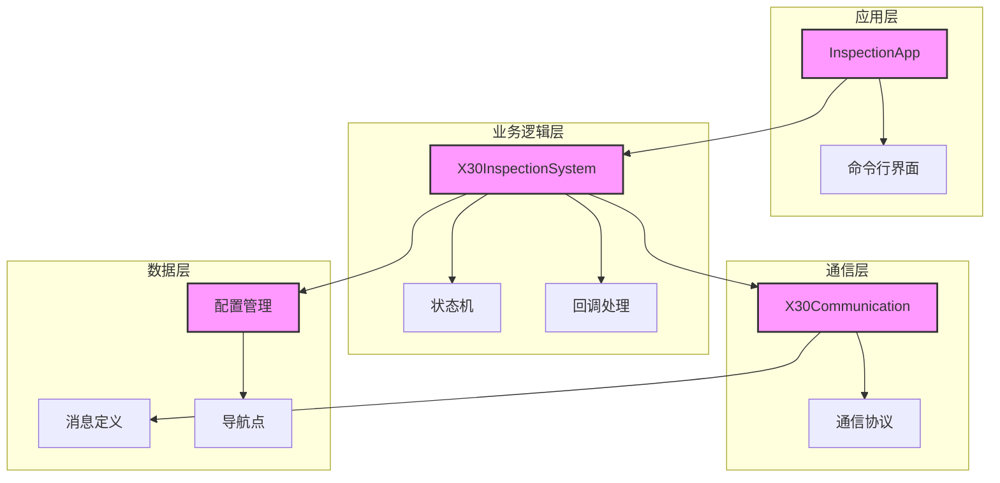

# X30巡检系统架构设计

## 系统架构图



## 模块说明

### 1. 应用层
- **InspectionApp**: 应用程序主类，负责整体流程控制
  - 初始化系统
  - 处理用户命令
  - 管理系统生命周期
- **命令行界面**: 提供用户交互功能
  - 显示系统状态
  - 接收用户命令
  - 展示执行结果

### 2. 业务逻辑层
- **X30InspectionSystem**: 核心业务逻辑处理
  - 管理巡检任务
  - 处理系统状态
  - 协调各模块工作
- **状态机**: 管理系统状态转换
  - 空闲状态
  - 导航状态
  - 错误状态
- **回调处理**: 处理异步事件
  - 任务开始/完成通知
  - 错误处理
  - 状态更新

### 3. 通信层
- **X30Communication**: 负责网络通信
  - TCP连接管理
  - 数据收发
  - 心跳维护
- **通信协议**: 实现消息协议
  - 消息序列化
  - 消息解析
  - 协议验证

### 4. 数据层
- **配置管理**: 处理系统配置
  - 读取配置文件
  - 解析配置项
  - 配置验证
- **消息定义**: 定义通信消息
  - 导航任务消息
  - 取消任务消息
  - 状态查询消息
- **导航点**: 管理导航数据
  - 导航点定义
  - 路径规划
  - 数据验证

## 文件结构

```
Intelligent_Inspection/
├── include/
│   ├── application/
│   │   └── x30_inspection_system.hpp
│   ├── communication/
│   │   └── x30_communication.hpp
│   ├── protocol/
│   │   └── x30_protocol.hpp
│   └── state/
│       └── x30_state_machine.hpp
├── src/
│   ├── application/
│   │   └── x30_inspection_system.cpp
│   ├── communication/
│   │   └── x30_communication.cpp
│   ├── protocol/
│   │   └── x30_protocol.cpp
│   └── main.cpp
├── config/
│   └── default_params.json
├── docs/
│   └── architecture.md
└── CMakeLists.txt
```

## 数据流

1. 用户输入命令 → InspectionApp
2. InspectionApp → X30InspectionSystem
3. X30InspectionSystem → 状态机处理
4. X30InspectionSystem → X30Communication
5. X30Communication ←→ 远程设备

## 扩展性设计

1. 命令处理机制支持轻松添加新命令
2. 状态机设计允许增加新的状态和转换
3. 通信协议支持新消息类型扩展
4. 配置管理支持灵活的配置项添加

## 错误处理

1. 异常捕获和处理机制
2. 状态机错误状态处理
3. 网络通信错误恢复
4. 配置错误检测和报告