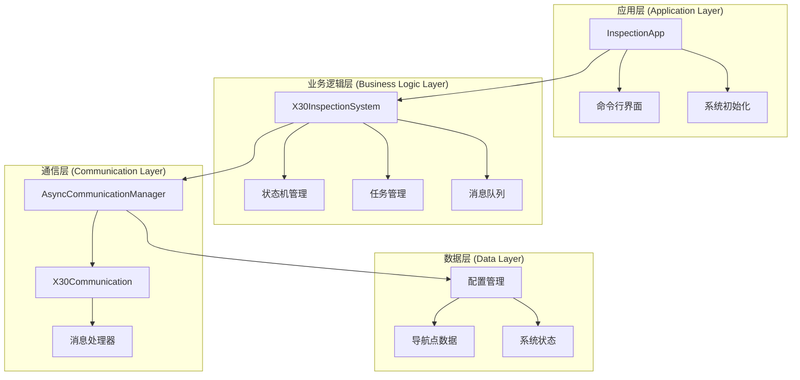
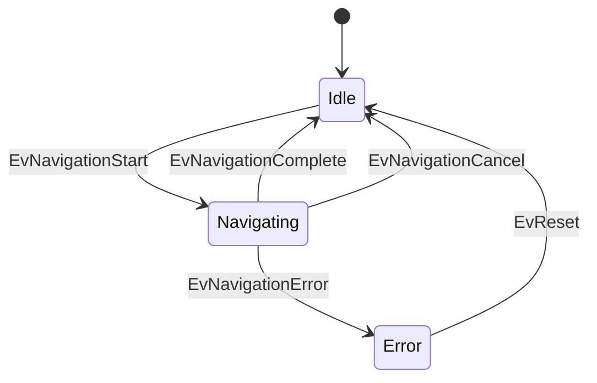
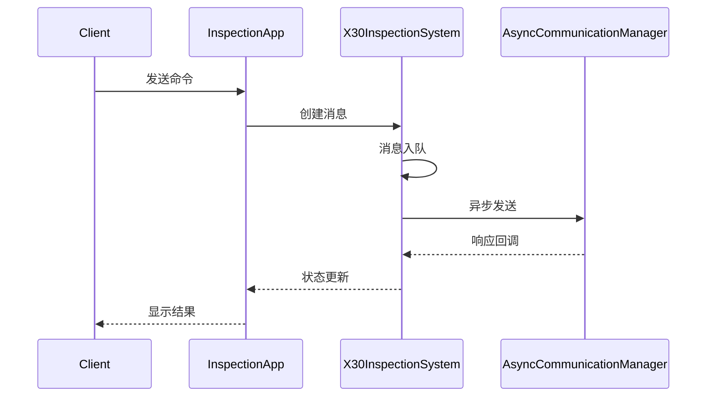

# X30巡检系统架构设计文档

## 1. 系统概述

### 1.1 设计目标
X30巡检系统旨在提供一个高性能、可靠且可扩展的智能巡检解决方案。系统基于C++17开发，采用现代C++特性和设计模式，实现了一个模块化、松耦合的分层架构。

### 1.2 关键特性
- 高性能异步通信架构
- 状态机驱动的业务流程
- 可扩展的插件系统
- 完善的错误处理机制
- 基于事件的消息处理

## 2. 系统架构

### 2.1 整体架构图



### 2.2 核心模块说明

#### 2.2.1 应用层 (Application Layer)
- **职责**：用户交互、系统初始化、任务调度
- **关键组件**：
  - `InspectionApp`: 应用程序主类
  - `CommandLineInterface`: 命令行交互接口
  - `SystemInitializer`: 系统初始化管理

#### 2.2.2 业务逻辑层 (Business Logic Layer)
- **职责**：业务流程控制、状态管理、任务处理
- **关键组件**：
  - `X30InspectionSystem`: 核心业务处理器
  - `X30StateMachine`: 状态机管理器
  - `TaskManager`: 任务管理器
  - `MessageQueue`: 消息队列处理器

#### 2.2.3 通信层 (Communication Layer)
- **职责**：网络通信、协议处理、消息分发
- **关键组件**：
  - `AsyncCommunicationManager`: 异步通信管理器
  - `X30Communication`: TCP通信实现
  - `MessageProcessor`: 消息处理器

#### 2.2.4 数据层 (Data Layer)
- **职责**：数据持久化、配置管理、状态存储
- **关键组件**：
  - `ConfigurationManager`: 配置管理器
  - `NavigationPointManager`: 导航点管理
  - `StateRepository`: 状态存储库

## 3. 核心流程设计

### 3.1 状态机设计


### 3.2 消息处理流程


## 4. 关键技术实现

### 4.1 异步通信实现
```cpp
class AsyncCommunicationManager {
    boost::asio::io_context io_context_;
    std::unique_ptr<boost::asio::io_context::work> work_;
    std::thread io_thread_;
    // ...
};
```

### 4.2 状态机实现
```cpp
struct X30StateMachine_ : public boost::msm::front::state_machine_def<X30StateMachine_> {
    typedef StateIdle initial_state;
    struct transition_table : boost::mpl::vector<
        _row<StateIdle, EvNavigationStart, StateNavigating>,
        _row<StateNavigating, EvNavigationComplete, StateIdle>,
        // ...
    > {};
};
```

### 4.3 消息队列实现
```cpp
template<typename T>
class ThreadSafeQueue {
    std::mutex mutex_;
    std::condition_variable not_empty_;
    std::queue<T> queue_;
    // ...
};
```

## 5. 性能优化设计

### 5.1 内存管理
- 使用智能指针管理资源
- 对象池复用机制
- 内存对齐优化

### 5.2 并发控制
- 基于strand的线程同步
- 无锁队列设计
- 异步操作链

### 5.3 I/O优化
- 零拷贝技术
- 缓冲区管理
- 异步I/O操作

## 6. 可扩展性设计

### 6.1 插件系统
- 动态加载机制
- 插件注册框架
- 接口适配器

### 6.2 配置系统
- JSON配置文件
- 动态参数调整
- 热加载支持

## 7. 错误处理机制

### 7.1 异常处理
- 分层异常处理
- 错误码映射
- 日志记录

### 7.2 故障恢复
- 状态恢复机制
- 断线重连
- 数据一致性保证

## 8. 开发规范

### 8.1 代码规范
- Google C++风格指南
- 命名约定
- 注释规范

### 8.2 版本控制
- Git分支管理
- 代码审查流程
- 持续集成

## 9. 部署架构

### 9.1 运行环境
- 操作系统要求
- 依赖库版本
- 硬件需求

### 9.2 监控系统
- 性能监控
- 日志收集
- 告警机制

## 10. 安全设计

### 10.1 通信安全
- 数据加密
- 身份认证
- 访问控制

### 10.2 数据安全
- 数据备份
- 权限管理
- 敏感信息保护
