# 架构图表

## 1. 系统架构概述

机器狗导航控制系统采用分层架构设计，明确划分系统职责，实现高内聚、低耦合的设计。本文档详细描述系统的架构设计及各层次间的交互关系。

### 1.1 系统分层架构图

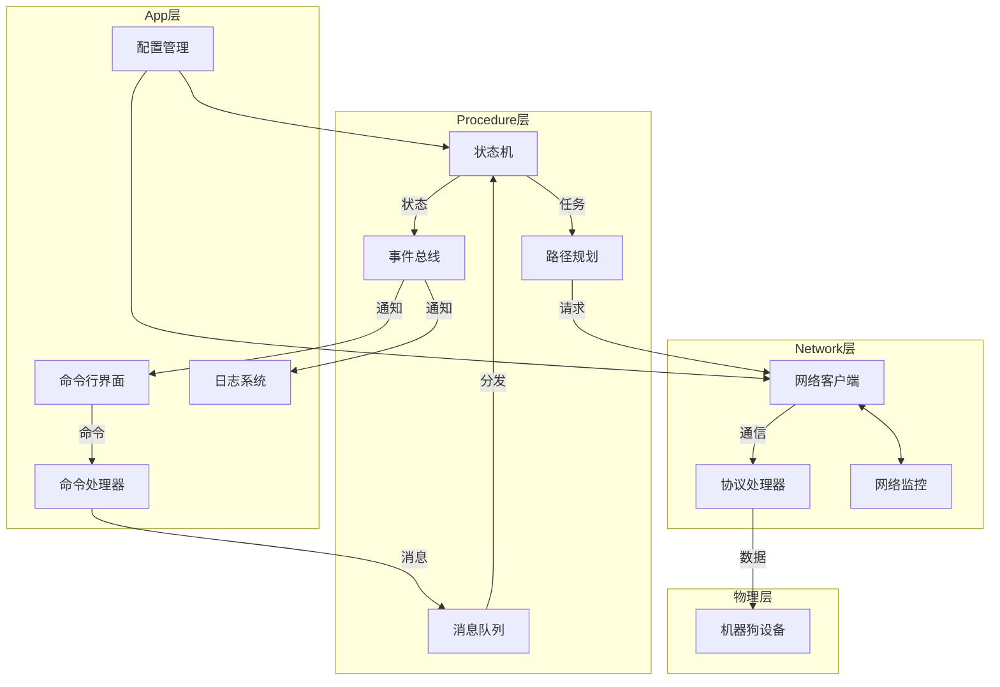
```mermaid
graph TD
    subgraph "物理层"
        RobotDog[机器狗设备]
    end

    subgraph "Network层"
        NC[网络客户端]
        PH[协议处理器]
        NM[网络监控]
    end

    subgraph "Procedure层"
        SM[状态机]
        PP[路径规划]
        MQ[消息队列]
        EB[事件总线]
    end

    subgraph "App层"
        CLI[命令行界面]
        CP[命令处理器]
        LG[日志系统]
        CM[配置管理]
    end

    %% 连接关系
    CLI -->|命令| CP
    CP -->|消息| MQ
    MQ -->|分发| SM
    SM -->|状态| EB
    EB -->|通知| CLI
    EB -->|通知| LG
    SM -->|任务| PP
    PP -->|请求| NC
    NC -->|通信| PH
    PH -->|数据| RobotDog
    NC <--> NM
    CM --> SM
    CM --> NC
```

### 1.2 立体架构视图

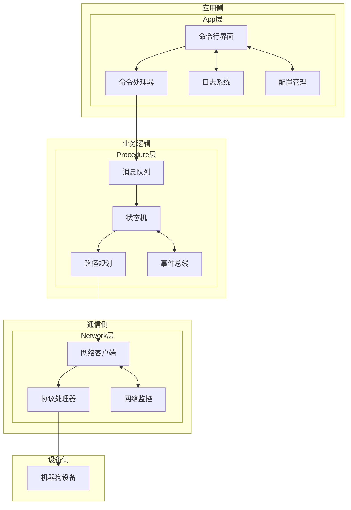
```mermaid
graph TD
    subgraph "应用侧"
        subgraph "App层"
            CLI[命令行界面]
            CP[命令处理器]
            LG[日志系统]
            CM[配置管理]
        end
    end

    subgraph "业务逻辑"
        subgraph "Procedure层"
            SM[状态机]
            PP[路径规划]
            MQ[消息队列]
            EB[事件总线]
        end
    end

    subgraph "通信侧"
        subgraph "Network层"
            NC[网络客户端]
            PH[协议处理器]
            NM[网络监控]
        end
    end

    subgraph "设备侧"
        RobotDog[机器狗设备]
    end

    %% 垂直连接
    CLI --> CP --> MQ --> SM --> PP --> NC --> PH --> RobotDog

    %% 水平连接
    CLI <--> LG
    CLI <--> CM
    SM <--> EB
    NC <--> NM
```

## 2. 分层职责详解

### 2.1 App层 (应用层)

应用层是系统顶层，负责与用户交互和整体协调。

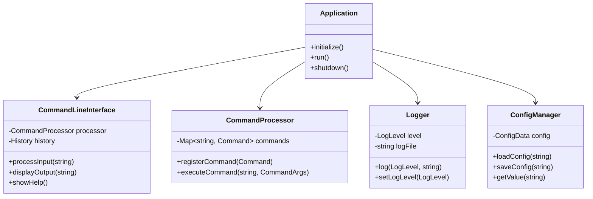
```mermaid
classDiagram
    class Application {
        +initialize()
        +run()
        +shutdown()
    }

    class CommandLineInterface {
        -CommandProcessor processor
        -History history
        +processInput(string)
        +displayOutput(string)
        +showHelp()
    }

    class CommandProcessor {
        -Map~string, Command~ commands
        +registerCommand(Command)
        +executeCommand(string, CommandArgs)
    }

    class Logger {
        -LogLevel level
        -string logFile
        +log(LogLevel, string)
        +setLogLevel(LogLevel)
    }

    class ConfigManager {
        -ConfigData config
        +loadConfig(string)
        +saveConfig(string)
        +getValue(string)
    }

    Application --> CommandLineInterface
    Application --> CommandProcessor
    Application --> Logger
    Application --> ConfigManager
```

**核心职责**:
- 命令行界面管理与用户交互
- 用户输入解析和命令执行
- 系统日志记录和管理
- 配置参数加载和管理
- 应用生命周期管理

### 2.2 Procedure层 (业务层)

业务层是系统核心，实现主要业务逻辑。

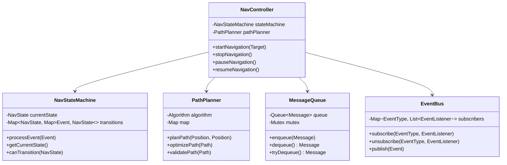
```mermaid
classDiagram
    class NavStateMachine {
        -NavState currentState
        -Map~NavState, Map~Event, NavState~~ transitions
        +processEvent(Event)
        +getCurrentState()
        +canTransition(NavState)
    }

    class PathPlanner {
        -Algorithm algorithm
        -Map map
        +planPath(Position, Position)
        +optimizePath(Path)
        +validatePath(Path)
    }

    class MessageQueue {
        -Queue~Message~ queue
        -Mutex mutex
        +enqueue(Message)
        +dequeue() Message
        +tryDequeue() Message
    }

    class EventBus {
        -Map~EventType, List~EventListener~~ subscribers
        +subscribe(EventType, EventListener)
        +unsubscribe(EventType, EventListener)
        +publish(Event)
    }

    class NavController {
        -NavStateMachine stateMachine
        -PathPlanner pathPlanner
        +startNavigation(Target)
        +stopNavigation()
        +pauseNavigation()
        +resumeNavigation()
    }

    NavController --> NavStateMachine
    NavController --> PathPlanner
    NavController --> MessageQueue
    NavController --> EventBus
```

**核心职责**:
- 导航状态机管理与状态转换
- 路径规划算法实现
- 消息队列处理和事件分发
- 导航业务逻辑实现
- 错误处理和恢复机制

### 2.3 Network层 (网络层)

网络层负责系统与外部设备通信。

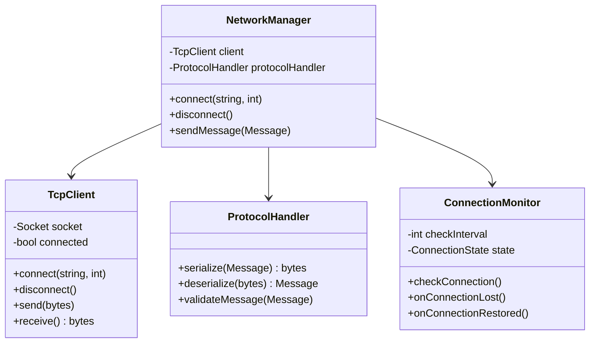
```mermaid
classDiagram
    class NetworkManager {
        -TcpClient client
        -ProtocolHandler protocolHandler
        +connect(string, int)
        +disconnect()
        +sendMessage(Message)
    }

    class TcpClient {
        -Socket socket
        -bool connected
        +connect(string, int)
        +disconnect()
        +send(bytes)
        +receive() bytes
    }

    class ProtocolHandler {
        +serialize(Message) bytes
        +deserialize(bytes) Message
        +validateMessage(Message)
    }

    class ConnectionMonitor {
        -int checkInterval
        -ConnectionState state
        +checkConnection()
        +onConnectionLost()
        +onConnectionRestored()
    }

    NetworkManager --> TcpClient
    NetworkManager --> ProtocolHandler
    NetworkManager --> ConnectionMonitor
```

**核心职责**:
- TCP连接管理与维护
- 消息序列化与反序列化
- 网络协议实现
- 连接状态监控
- 网络异常处理

## 3. 组件间交互流程

### 3.1 命令处理流程

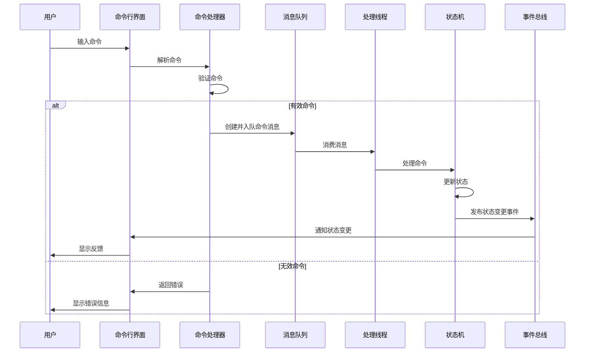
```mermaid
sequenceDiagram
    participant User as 用户
    participant CLI as 命令行界面
    participant CP as 命令处理器
    participant MQ as 消息队列
    participant PT as 处理线程
    participant SM as 状态机
    participant EB as 事件总线

    User->>CLI: 输入命令
    CLI->>CP: 解析命令
    CP->>CP: 验证命令

    alt 有效命令
        CP->>MQ: 创建并入队命令消息
        MQ->>PT: 消费消息
        PT->>SM: 处理命令
        SM->>SM: 更新状态
        SM->>EB: 发布状态变更事件
        EB->>CLI: 通知状态变更
        CLI->>User: 显示反馈
    else 无效命令
        CP->>CLI: 返回错误
        CLI->>User: 显示错误信息
    end
```

### 3.2 导航执行流程

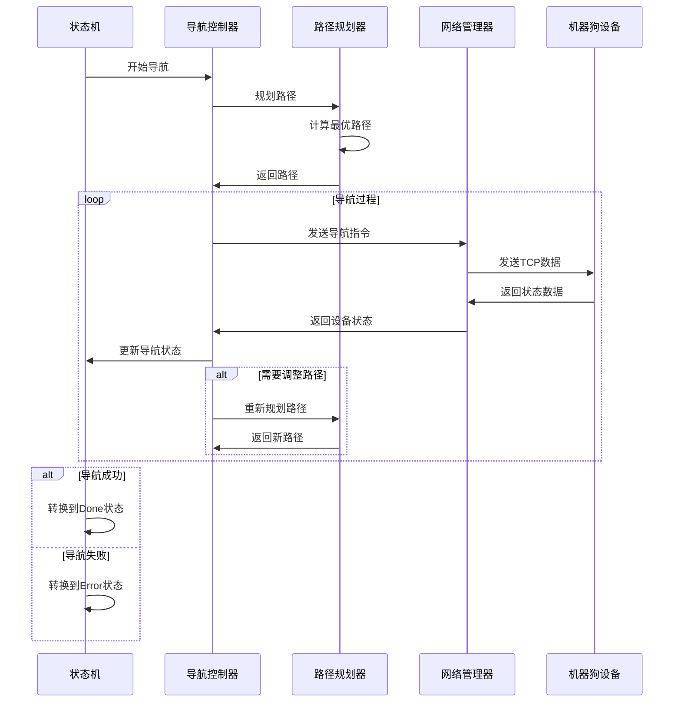
```mermaid
sequenceDiagram
    participant SM as 状态机
    participant NC as 导航控制器
    participant PP as 路径规划器
    participant NM as 网络管理器
    participant RD as 机器狗设备

    SM->>NC: 开始导航
    NC->>PP: 规划路径
    PP->>PP: 计算最优路径
    PP->>NC: 返回路径

    loop 导航过程
        NC->>NM: 发送导航指令
        NM->>RD: 发送TCP数据
        RD->>NM: 返回状态数据
        NM->>NC: 返回设备状态
        NC->>SM: 更新导航状态

        alt 需要调整路径
            NC->>PP: 重新规划路径
            PP->>NC: 返回新路径
        end
    end

    alt 导航成功
        SM->>SM: 转换到Done状态
    else 导航失败
        SM->>SM: 转换到Error状态
    end
```

### 3.3 错误处理流程

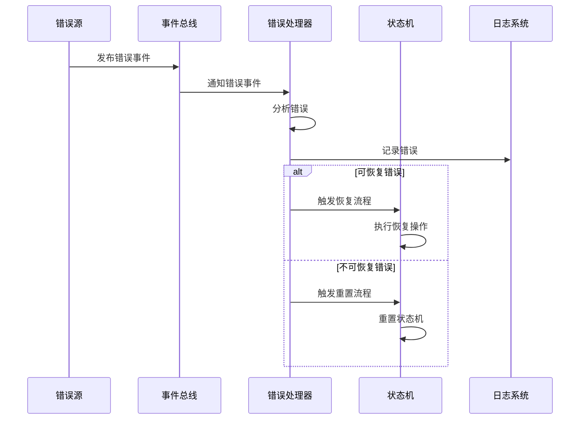
```mermaid
sequenceDiagram
    participant Source as 错误源
    participant EB as 事件总线
    participant EH as 错误处理器
    participant SM as 状态机
    participant LG as 日志系统

    Source->>EB: 发布错误事件
    EB->>EH: 通知错误事件
    EH->>EH: 分析错误
    EH->>LG: 记录错误

    alt 可恢复错误
        EH->>SM: 触发恢复流程
        SM->>SM: 执行恢复操作
    else 不可恢复错误
        EH->>SM: 触发重置流程
        SM->>SM: 重置状态机
    end
```

## 4. 数据流图

### 4.1 系统整体数据流

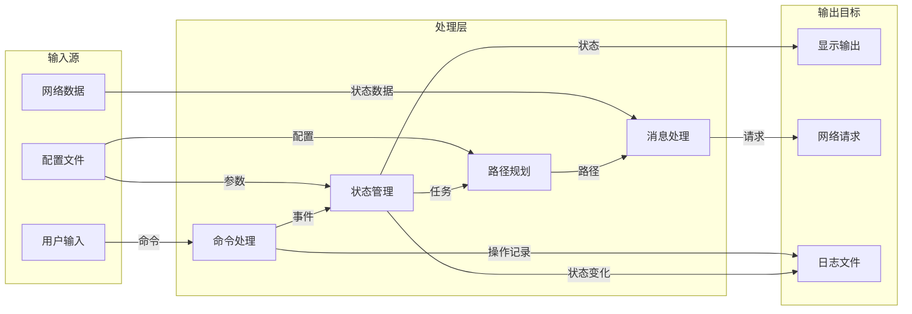
```mermaid
graph LR
    subgraph 输入源
        UI[用户输入]
        ND[网络数据]
        CF[配置文件]
    end

    subgraph 处理层
        CP[命令处理]
        SM[状态管理]
        PP[路径规划]
        MP[消息处理]
    end

    subgraph 输出目标
        DO[显示输出]
        NR[网络请求]
        LF[日志文件]
    end

    %% 输入到处理
    UI -->|命令| CP
    ND -->|状态数据| MP
    CF -->|参数| SM
    CF -->|配置| PP

    %% 处理层内部
    CP -->|事件| SM
    SM -->|任务| PP
    PP -->|路径| MP

    %% 处理到输出
    SM -->|状态| DO
    MP -->|请求| NR
    CP -->|操作记录| LF
    SM -->|状态变化| LF
```

### 4.2 消息流转图

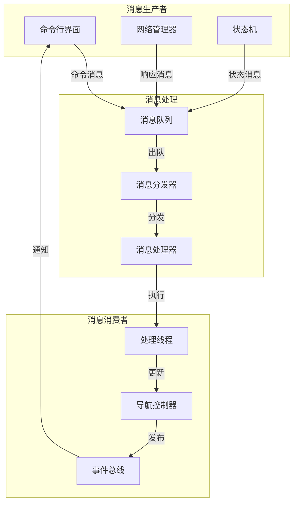
```mermaid
graph TD
    subgraph 消息生产者
        CLI[命令行界面]
        NM[网络管理器]
        SM[状态机]
    end

    subgraph 消息处理
        MQ[消息队列]
        MD[消息分发器]
        MH[消息处理器]
    end

    subgraph 消息消费者
        PT[处理线程]
        NC[导航控制器]
        EB[事件总线]
    end

    %% 生产者到队列
    CLI -->|命令消息| MQ
    NM -->|响应消息| MQ
    SM -->|状态消息| MQ

    %% 队列到处理
    MQ -->|出队| MD
    MD -->|分发| MH

    %% 处理到消费者
    MH -->|执行| PT
    PT -->|更新| NC
    NC -->|发布| EB
    EB -->|通知| CLI
```

## 5. 包依赖关系

### 5.1 包结构图

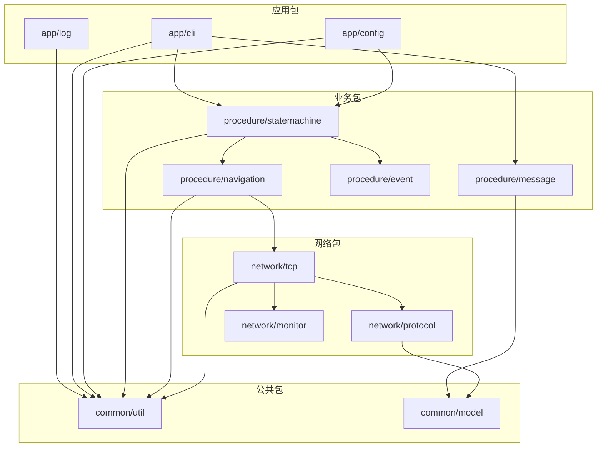
```mermaid
graph TD
    subgraph 应用包
        app_cli[app/cli]
        app_config[app/config]
        app_log[app/log]
    end

    subgraph 业务包
        proc_sm[procedure/statemachine]
        proc_nav[procedure/navigation]
        proc_msg[procedure/message]
        proc_event[procedure/event]
    end

    subgraph 网络包
        net_tcp[network/tcp]
        net_proto[network/protocol]
        net_monitor[network/monitor]
    end

    subgraph 公共包
        common_util[common/util]
        common_model[common/model]
    end

    %% 包间依赖
    app_cli --> proc_sm
    app_cli --> proc_msg
    app_config --> proc_sm
    app_log --> common_util

    proc_sm --> proc_nav
    proc_sm --> proc_event
    proc_nav --> net_tcp
    proc_msg --> common_model

    net_tcp --> net_proto
    net_tcp --> net_monitor
    net_proto --> common_model

    %% 所有包依赖公共包
    app_cli --> common_util
    app_config --> common_util
    proc_sm --> common_util
    proc_nav --> common_util
    net_tcp --> common_util
```

### 5.2 模块依赖矩阵

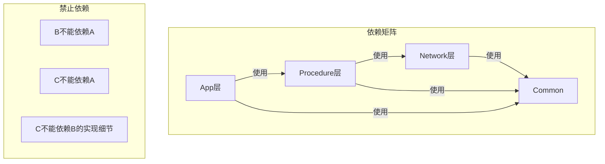
```mermaid
graph TD
    subgraph "依赖矩阵"
        direction LR
        A[App层] -->|使用| B[Procedure层]
        B -->|使用| C[Network层]
        B -->|使用| D[Common]
        A -->|使用| D
        C -->|使用| D
    end

    subgraph "禁止依赖"
        direction LR
        X1[B不能依赖A]
        X2[C不能依赖A]
        X3[C不能依赖B的实现细节]
    end
```

## 6. 设计模式应用

### 6.1 状态模式 (StateMachine)

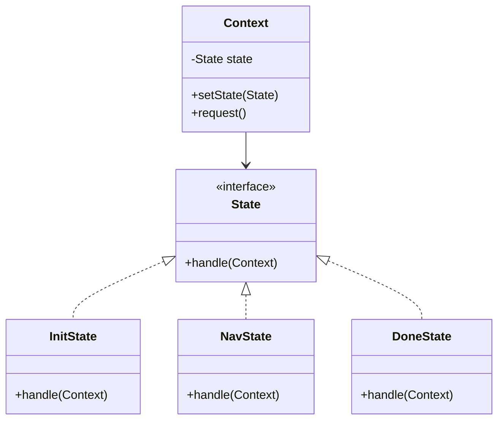
```mermaid
classDiagram
    class Context {
        -State state
        +setState(State)
        +request()
    }

    class State {
        <<interface>>
        +handle(Context)
    }

    class InitState {
        +handle(Context)
    }

    class NavState {
        +handle(Context)
    }

    class DoneState {
        +handle(Context)
    }

    Context --> State
    State <|.. InitState
    State <|.. NavState
    State <|.. DoneState
```

### 6.2 观察者模式 (EventBus)

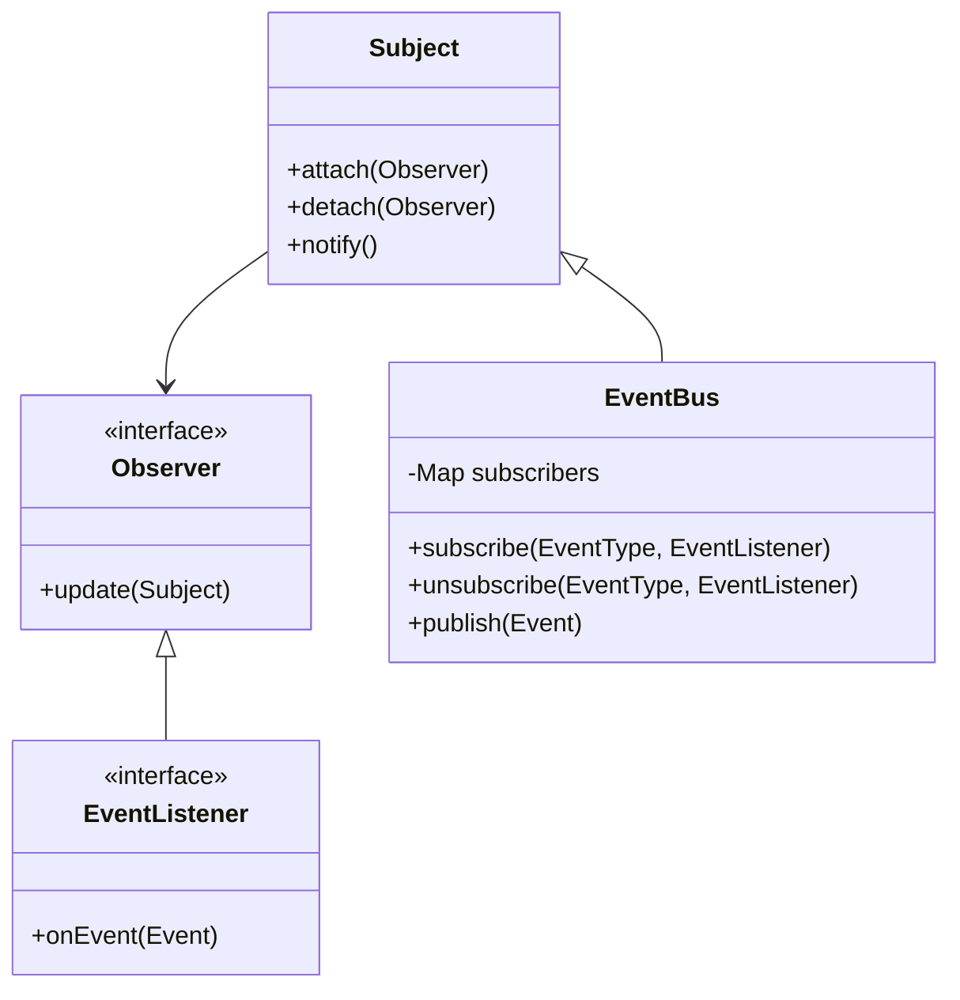
```mermaid
classDiagram
    class Subject {
        +attach(Observer)
        +detach(Observer)
        +notify()
    }

    class Observer {
        <<interface>>
        +update(Subject)
    }

    class EventBus {
        -Map subscribers
        +subscribe(EventType, EventListener)
        +unsubscribe(EventType, EventListener)
        +publish(Event)
    }

    class EventListener {
        <<interface>>
        +onEvent(Event)
    }

    Subject <|-- EventBus
    Observer <|-- EventListener
    Subject --> Observer
```

### 6.3 命令模式 (Command)

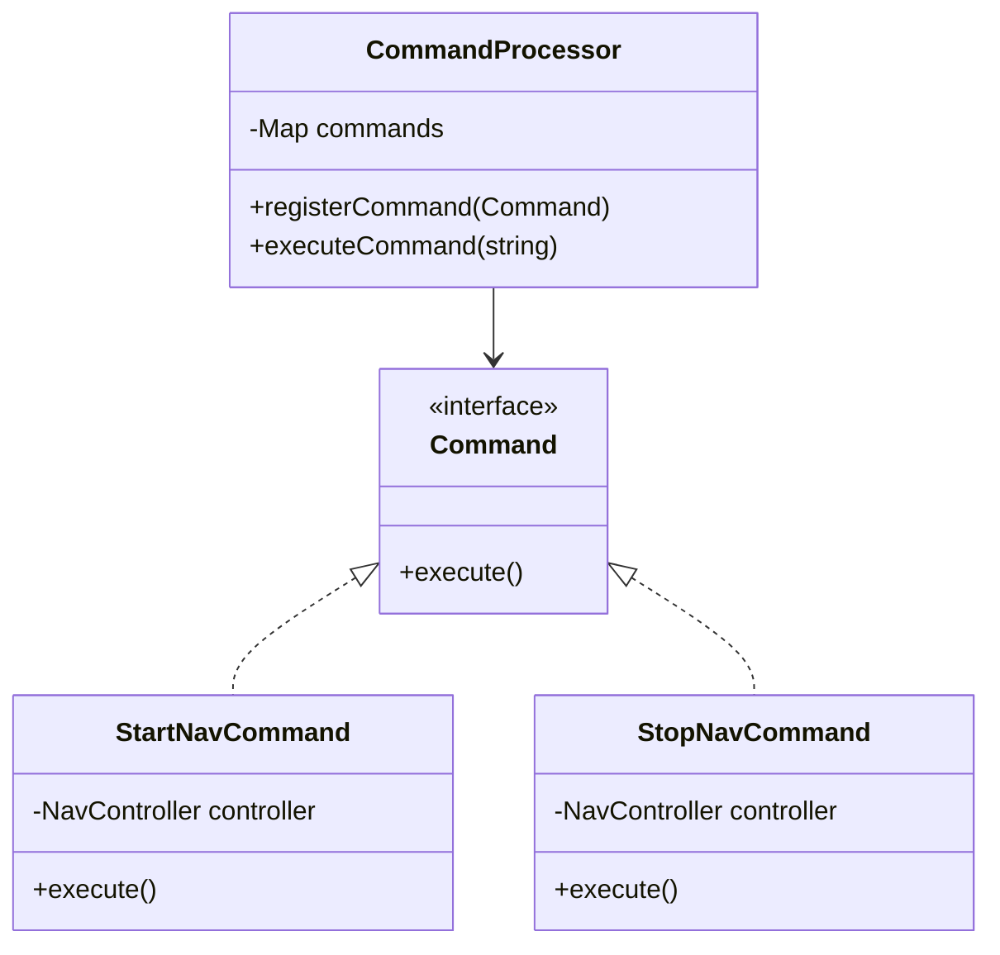
```mermaid
classDiagram
    class Command {
        <<interface>>
        +execute()
    }

    class StartNavCommand {
        -NavController controller
        +execute()
    }

    class StopNavCommand {
        -NavController controller
        +execute()
    }

    class CommandProcessor {
        -Map commands
        +registerCommand(Command)
        +executeCommand(string)
    }

    Command <|.. StartNavCommand
    Command <|.. StopNavCommand
    CommandProcessor --> Command
```

### 6.4 策略模式 (Algorithm)

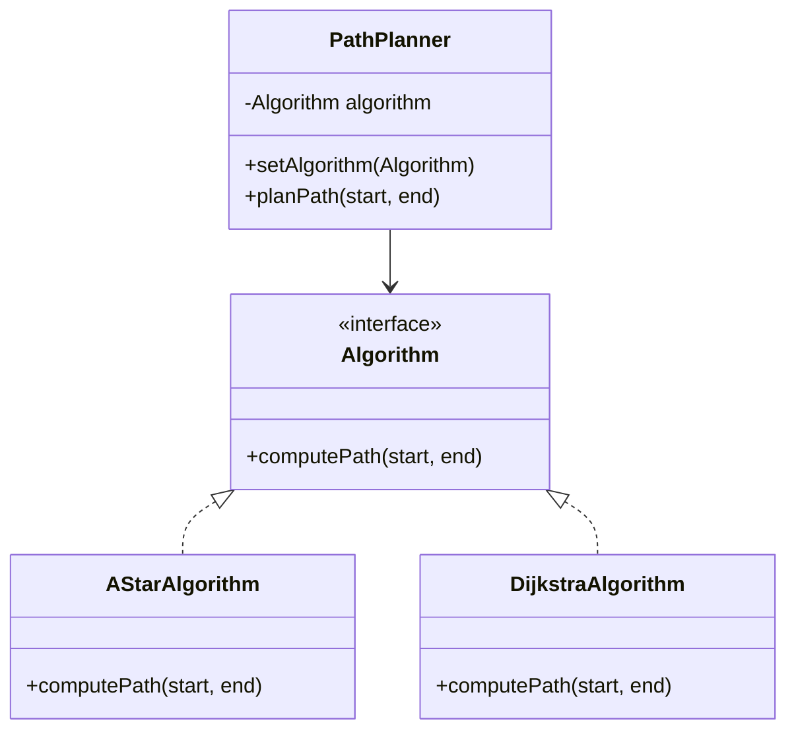
```mermaid
classDiagram
    class PathPlanner {
        -Algorithm algorithm
        +setAlgorithm(Algorithm)
        +planPath(start, end)
    }

    class Algorithm {
        <<interface>>
        +computePath(start, end)
    }

    class AStarAlgorithm {
        +computePath(start, end)
    }

    class DijkstraAlgorithm {
        +computePath(start, end)
    }

    PathPlanner --> Algorithm
    Algorithm <|.. AStarAlgorithm
    Algorithm <|.. DijkstraAlgorithm
```

### 6.5 适配器模式 (Network)

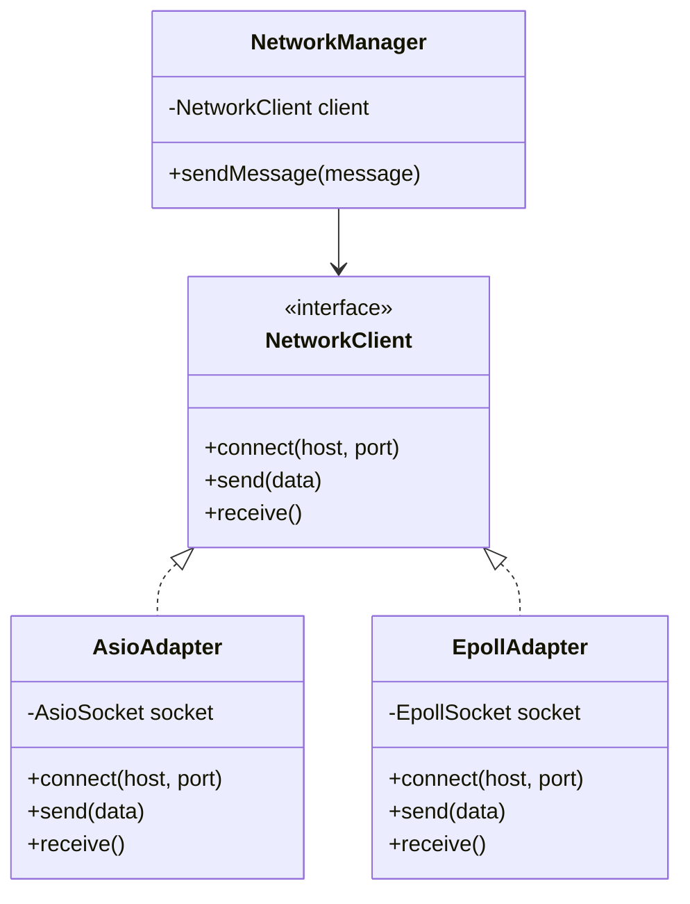
```mermaid
classDiagram
    class NetworkClient {
        <<interface>>
        +connect(host, port)
        +send(data)
        +receive()
    }

    class AsioAdapter {
        -AsioSocket socket
        +connect(host, port)
        +send(data)
        +receive()
    }

    class EpollAdapter {
        -EpollSocket socket
        +connect(host, port)
        +send(data)
        +receive()
    }

    class NetworkManager {
        -NetworkClient client
        +sendMessage(message)
    }

    NetworkClient <|.. AsioAdapter
    NetworkClient <|.. EpollAdapter
    NetworkManager --> NetworkClient
```

## 7. 部署架构

### 7.1 物理部署图

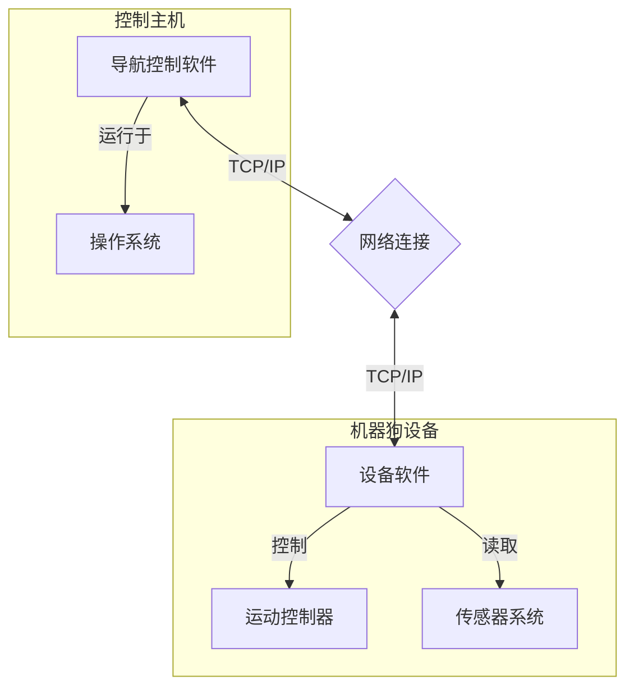
```mermaid
graph TD
    subgraph "控制主机"
        NavSoftware[导航控制软件]
        OS[操作系统]
    end

    subgraph "机器狗设备"
        MotionController[运动控制器]
        Sensors[传感器系统]
        DeviceSoftware[设备软件]
    end

    NetworkConnection{网络连接}

    NavSoftware -->|运行于| OS
    NavSoftware <-->|TCP/IP| NetworkConnection
    NetworkConnection <-->|TCP/IP| DeviceSoftware
    DeviceSoftware -->|控制| MotionController
    DeviceSoftware -->|读取| Sensors
```

### 7.2 软件部署视图

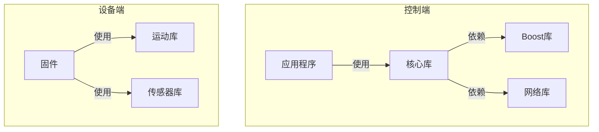
```mermaid
graph TD
    subgraph "控制端"
        NavApp[应用程序]
        NavLib[核心库]
        BoostLib[Boost库]
        NetLib[网络库]
    end

    subgraph "设备端"
        DeviceFirmware[固件]
        MotionLib[运动库]
        SensorLib[传感器库]
    end

    NavApp -->|使用| NavLib
    NavLib -->|依赖| BoostLib
    NavLib -->|依赖| NetLib

    DeviceFirmware -->|使用| MotionLib
    DeviceFirmware -->|使用| SensorLib
```

## 8. 扩展性和可维护性设计

### 8.1 插件架构

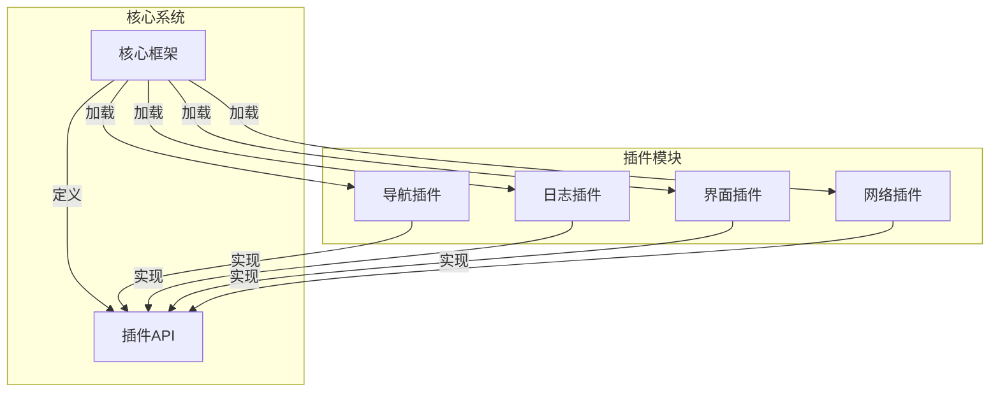
```mermaid
graph TD
    subgraph "核心系统"
        Core[核心框架]
        API[插件API]
    end

    subgraph "插件模块"
        NavPlugin[导航插件]
        LogPlugin[日志插件]
        UIPlugin[界面插件]
        NetPlugin[网络插件]
    end

    Core -->|定义| API
    NavPlugin -->|实现| API
    LogPlugin -->|实现| API
    UIPlugin -->|实现| API
    NetPlugin -->|实现| API

    Core -->|加载| NavPlugin
    Core -->|加载| LogPlugin
    Core -->|加载| UIPlugin
    Core -->|加载| NetPlugin
```

### 8.2 可配置架构

```mermaid
graph TD
    ConfigFile[配置文件]

    subgraph "运行时配置系统"
        ConfigManager[配置管理器]
        ConfigMonitor[配置监控]
    end

    subgraph "可配置组件"
        NavComponent[导航组件]
        NetComponent[网络组件]
        LogComponent[日志组件]
    end

    ConfigFile -->|加载| ConfigManager
    ConfigMonitor -->|监控| ConfigFile
    ConfigMonitor -->|通知| ConfigManager

    ConfigManager -->|配置| NavComponent
    ConfigManager -->|配置| NetComponent
    ConfigManager -->|配置| LogComponent
```

## 9. 架构质量属性

### 9.1 性能优化架构

```mermaid
graph TD
    subgraph "性能关键路径"
        A[命令输入] -->|优化| B[消息处理]
        B -->|优化| C[状态转换]
        C -->|优化| D[网络通信]
    end

    subgraph "性能优化策略"
        P1[无锁数据结构]
        P2[内存池管理]
        P3[批处理操作]
        P4[并行计算]
    end

    B -->|应用| P1
    B -->|应用| P2
    C -->|应用| P3
    D -->|应用| P4
```

### 9.2 可靠性架构

```mermaid
graph TD
    subgraph "错误处理机制"
        E1[异常捕获]
        E2[错误恢复]
        E3[状态回滚]
        E4[故障隔离]
    end

    subgraph "可靠性策略"
        R1[健康检查]
        R2[超时机制]
        R3[心跳检测]
        R4[冗余设计]
    end

    E1 --> R1
    E2 --> R2
    E3 --> R3
    E4 --> R4
```

### 9.3 安全性架构

```mermaid
graph TD
    subgraph "安全控制点"
        S1[输入验证]
        S2[认证授权]
        S3[敏感数据处理]
        S4[通信加密]
    end

    subgraph "安全实现"
        I1[输入过滤器]
        I2[访问控制]
        I3[数据脱敏]
        I4[TLS加密]
    end

    S1 -->|实现| I1
    S2 -->|实现| I2
    S3 -->|实现| I3
    S4 -->|实现| I4
```

## 10. 演进路线

### 10.1 架构演进规划

```mermaid
graph TD
    V1[v1.0 基础架构] -->|增强| V2[v2.0 分布式架构]
    V2 -->|增强| V3[v3.0 云端集成]

    subgraph "当前阶段: v1.0"
        C1[单机部署]
        C2[基础功能]
        C3[命令行界面]
    end

    subgraph "下一阶段: v2.0"
        N1[集群部署]
        N2[高级导航]
        N3[Web界面]
    end

    subgraph "未来阶段: v3.0"
        F1[云端控制]
        F2[AI决策]
        F3[移动应用]
    end
```

### 10.2 技术债务管理

```mermaid
graph TD
    subgraph "技术债务识别"
        D1[代码复杂度]
        D2[测试覆盖率]
        D3[文档完整性]
        D4[依赖更新]
    end

    subgraph "债务处理策略"
        S1[重构计划]
        S2[测试自动化]
        S3[文档生成]
        S4[依赖管理]
    end

    D1 -->|解决| S1
    D2 -->|解决| S2
    D3 -->|解决| S3
    D4 -->|解决| S4
```

## 11. 设计决策记录

### 11.1 关键决策记录

- **状态机选择**: 选用Boost.MSM而非手动实现，提高可靠性
- **网络模型**: 支持Asio和Epoll两种模型，适应不同场景
- **线程模型**: 采用固定三线程设计，避免过度并发
- **消息处理**: 基于生产者-消费者模式，实现解耦
- **错误处理**: 使用异常+错误码混合机制，平衡性能和可靠性

### 11.2 取舍考量

- **性能 vs 可维护性**: 在关键路径优先考虑性能，其他部分优先可维护性
- **灵活性 vs 复杂性**: 接口设计平衡扩展性与使用难度
- **跨平台 vs 特性利用**: 核心功能跨平台，特定优化允许平台相关
- **内存占用 vs 响应速度**: 适度使用缓存提升响应，控制总体内存占用
