# 系统组件类图

## 1. 整体类图结构

以下类图展示了机器狗导航控制系统的主要组件及其关系。

### 1.1 系统整体类图

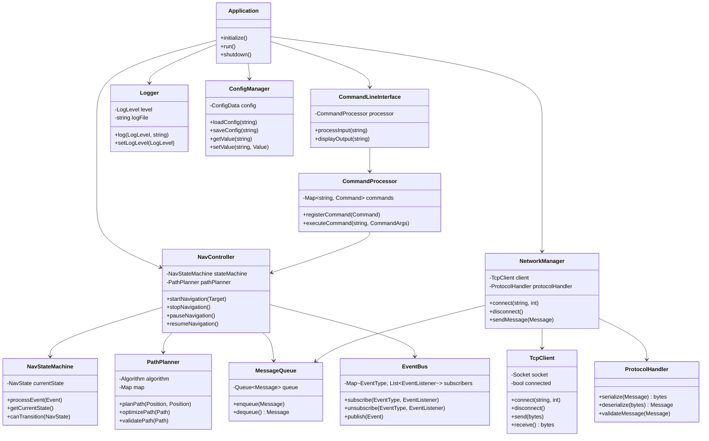

## 2. 分层类图

系统分为三个主要层次，每个层次有各自的组件和职责。

### 2.1 应用层类图

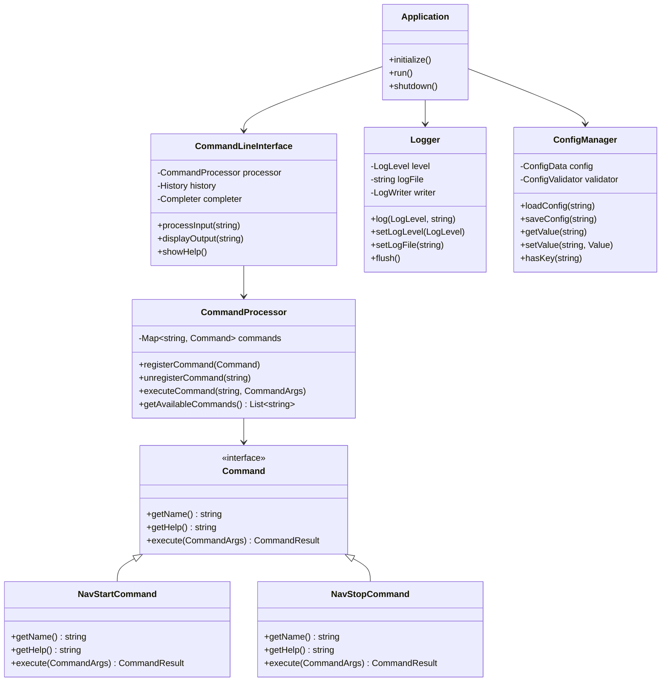

### 2.2 业务层类图

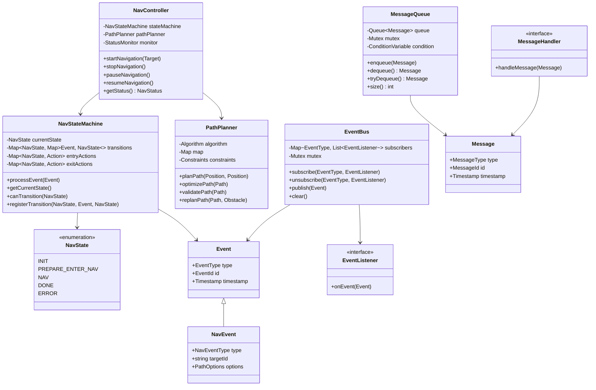

### 2.3 网络层类图

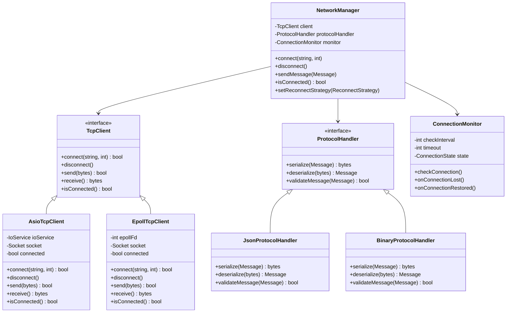

## 3. 核心组件详细设计

### 3.1 状态机类设计

状态机是系统的核心组件，负责管理系统状态转换。

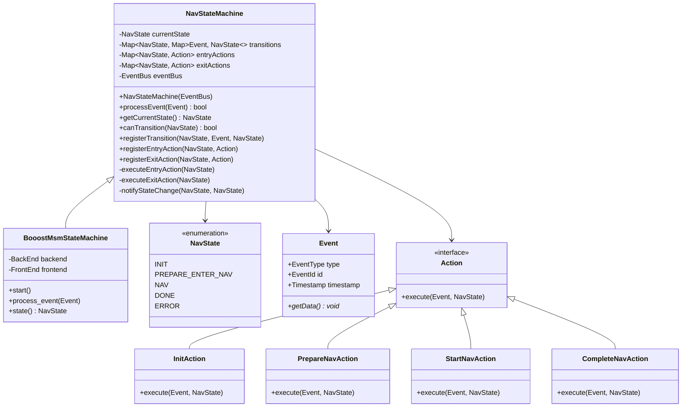

### 3.2 消息队列与事件总线类设计

消息队列和事件总线是系统的通信骨干，实现组件间的解耦。

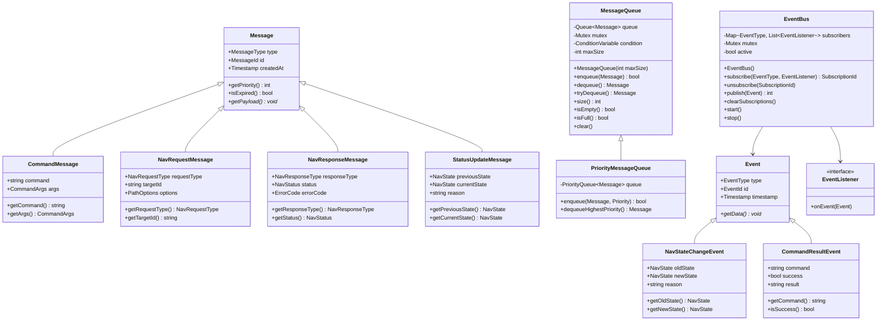

### 3.3 网络通信类设计

网络通信模块负责与机器狗设备的数据交换。

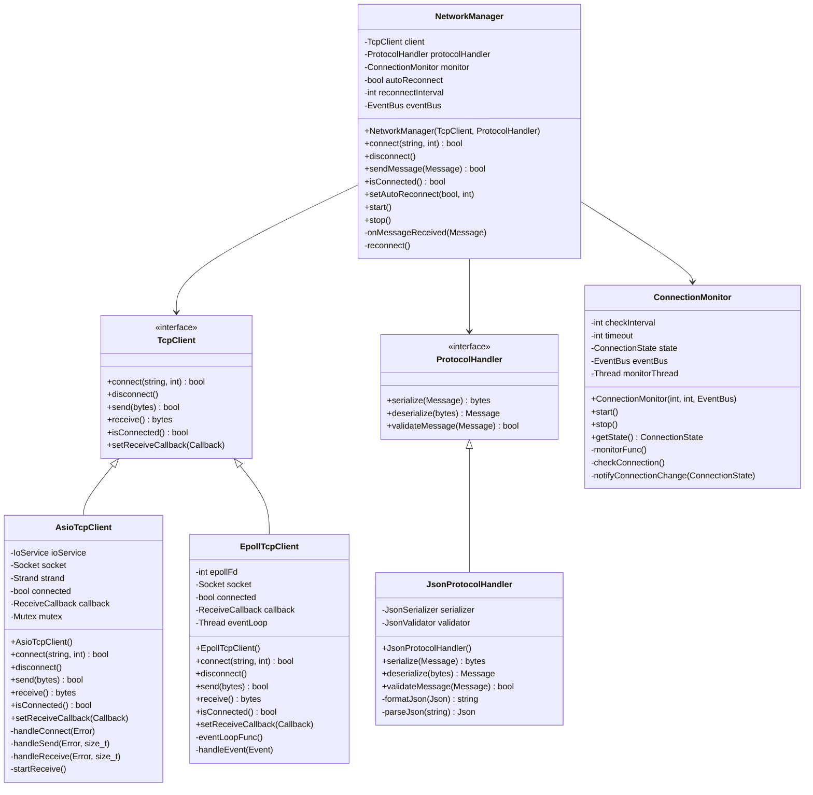

## 4. 跨层交互类图

展示三个层次的组件如何协同工作。

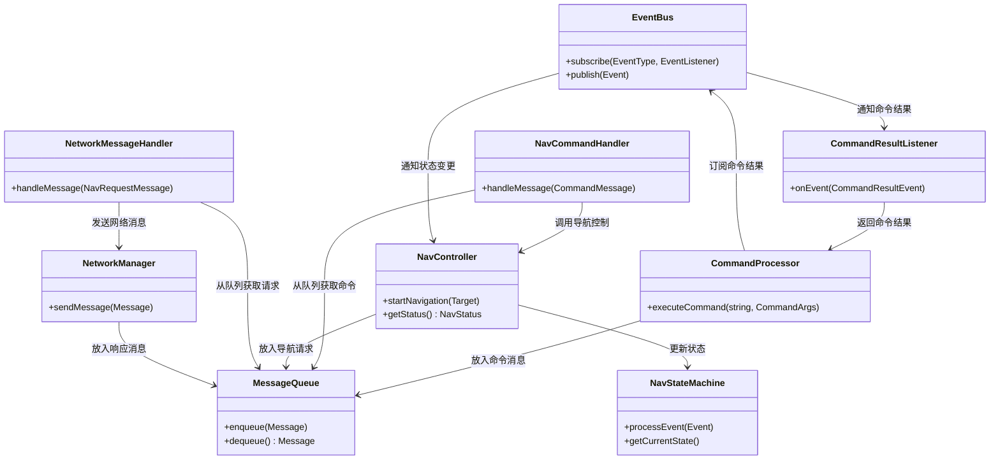

## 5. 设计模式应用

系统中使用了多种设计模式，提高了代码的可维护性和扩展性。

### 5.1 观察者模式（事件总线）

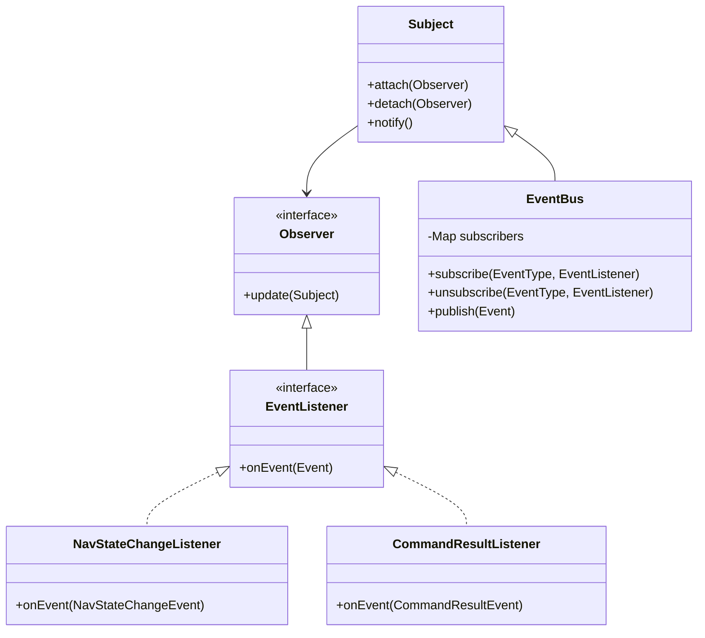

### 5.2 命令模式（命令处理器）

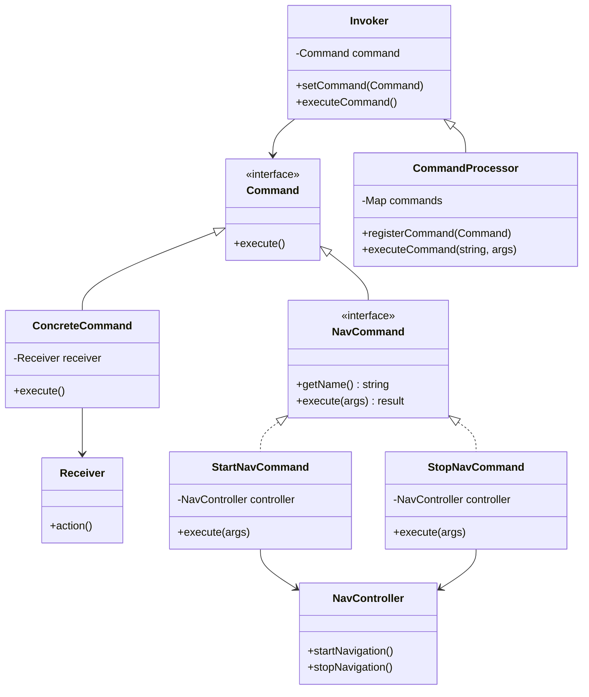

### 5.3 状态模式（导航状态机）

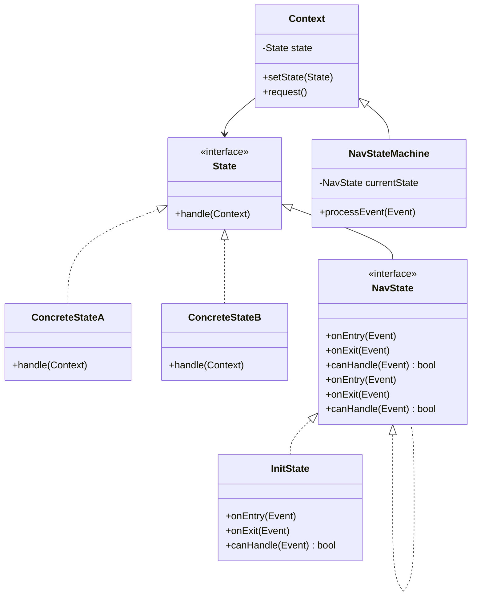

### 5.4 策略模式（路径规划算法）

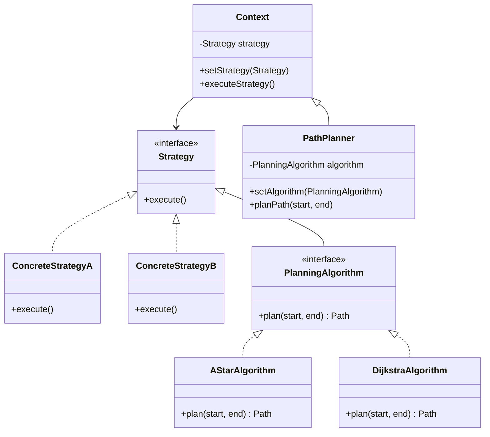

## 6. 类设计原则

系统设计遵循了以下面向对象设计原则：

### 6.1 单一职责原则 (SRP)

每个类都有明确的单一职责：
- `NavController` - 仅负责导航控制逻辑
- `NetworkManager` - 仅负责网络通信
- `Logger` - 仅负责日志记录

### 6.2 开放封闭原则 (OCP)

系统设计对扩展开放，对修改封闭：
- 通过接口和抽象类允许不同实现（如`TcpClient`接口）
- 使用策略模式实现算法替换（如`PlanningAlgorithm`）
- 命令模式允许添加新命令而不修改命令处理器

### 6.3 依赖倒置原则 (DIP)

高层模块不依赖低层模块，而是依赖抽象：
- `NavController`依赖`PathPlanner`接口而非具体实现
- `NetworkManager`依赖`TcpClient`接口而非具体的网络实现
- `EventBus`依赖`EventListener`接口而非具体订阅者

### 6.4 接口隔离原则 (ISP)

使用细粒度的专用接口而非宽泛的通用接口：
- 消息处理使用不同的处理器接口
- 事件监听使用专门的事件监听器
- 命令执行使用特定的命令接口

### 6.5 组合优于继承

系统优先使用组合而非继承：
- `NavController`组合了`NavStateMachine`而非继承
- `NetworkManager`组合了`TcpClient`和`ProtocolHandler`
- `CommandProcessor`组合了多个`Command`对象
