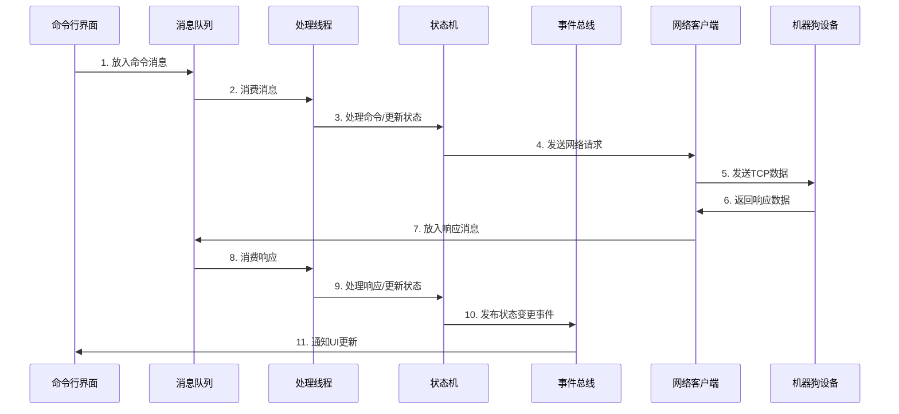
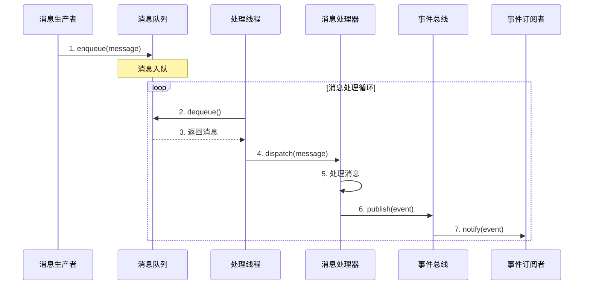
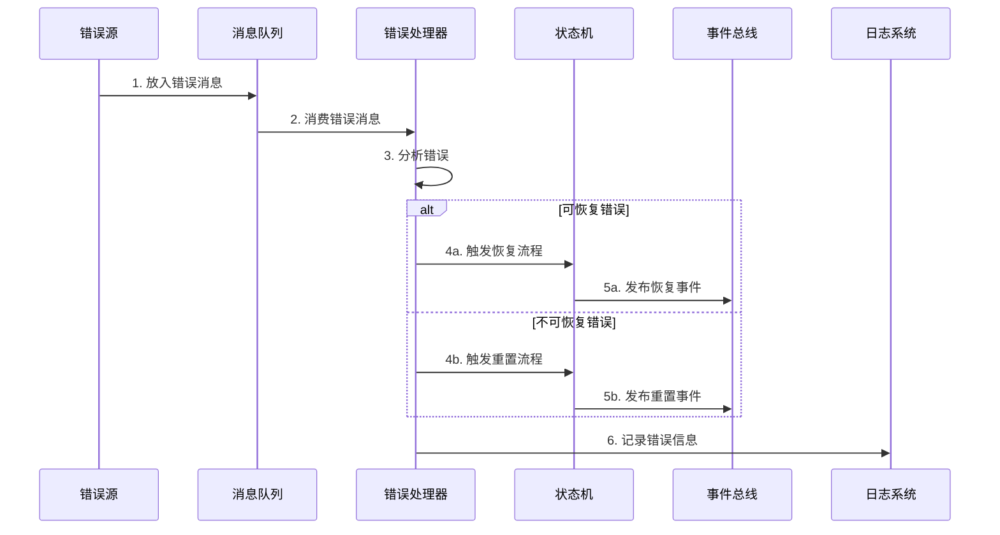
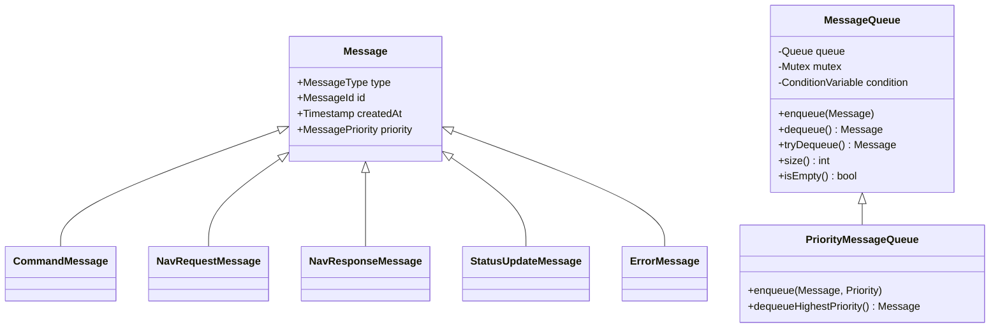
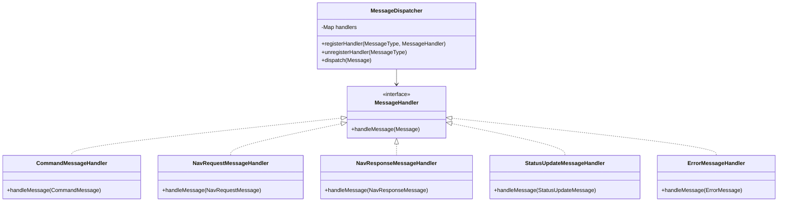
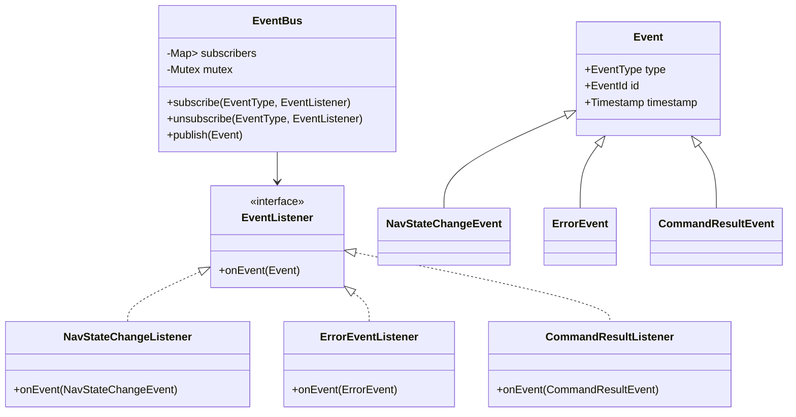
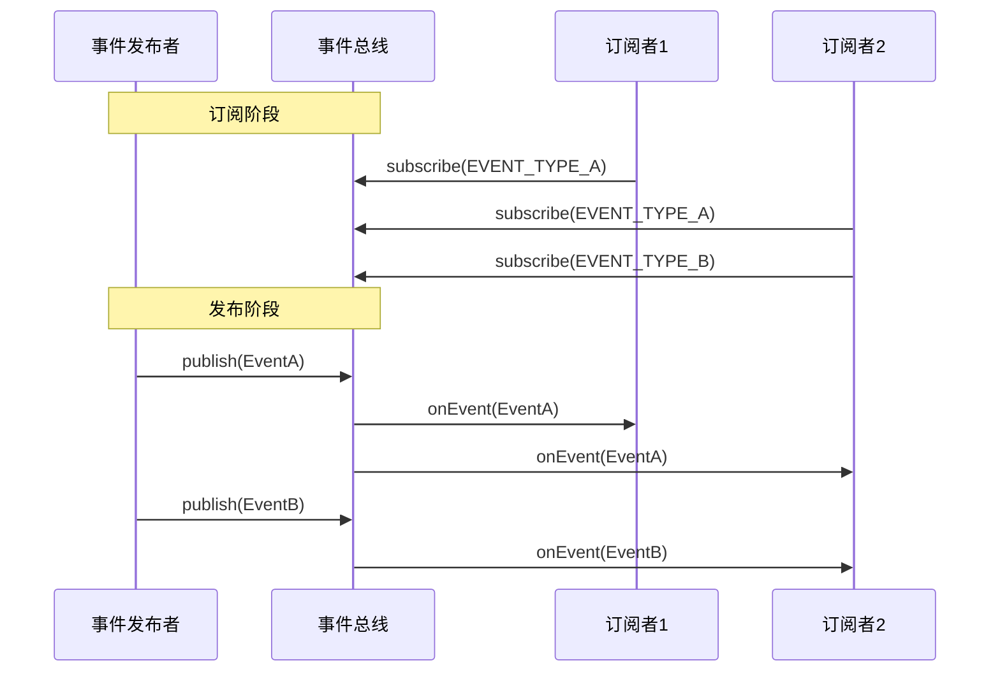
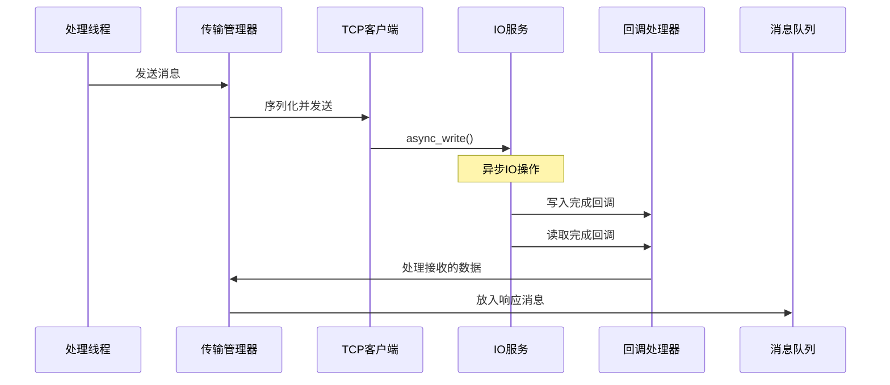
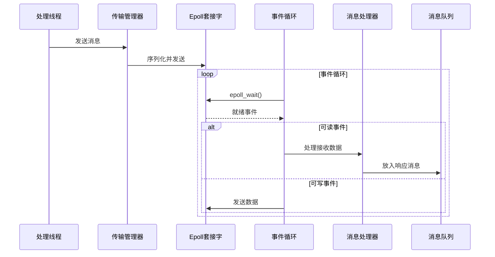
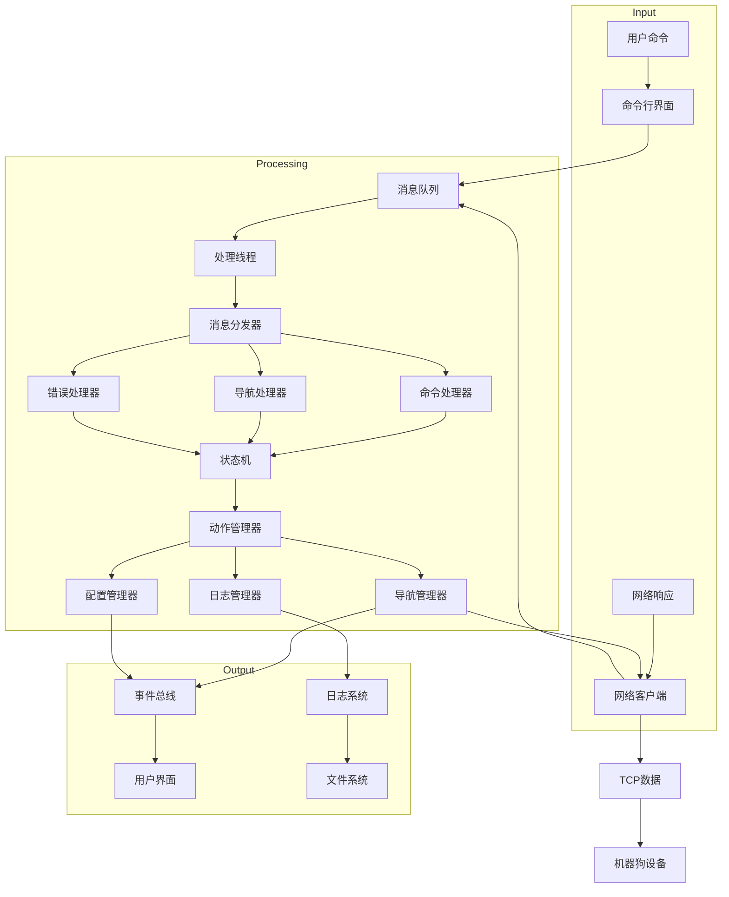

# 消息流程图表

## 1. 系统消息流转概览

本文档描述机器狗导航控制系统中消息的流转路径、类型和处理机制。

### 1.1 基本消息流转图



### 1.2 异步消息处理流程



### 1.3 错误处理流程



## 2. 消息类型定义

系统中存在多种类型的消息，每种类型有不同的处理流程。

### 2.1 命令消息 (CommandMessage)

用户通过CLI输入的命令转换为命令消息进入系统处理流程。

```cpp
struct CommandMessage : public Message {
    std::string command;      // 命令名称
    CommandArgs arguments;    // 命令参数
    MessageId correlationId;  // 关联ID
};
```

### 2.2 导航请求消息 (NavRequestMessage)

从处理线程发往网络层的导航请求。

```cpp
struct NavRequestMessage : public Message {
    NavRequestType type;      // 请求类型(START/STOP/PAUSE等)
    std::string targetId;     // 目标位置
    PathPlanOptions options;  // 路径规划选项
};
```

### 2.3 导航响应消息 (NavResponseMessage)

从网络层返回的导航操作结果。

```cpp
struct NavResponseMessage : public Message {
    NavResponseType type;     // 响应类型
    NavStatus status;         // 导航状态
    ErrorCode errorCode;      // 错误代码(如果有)
    Position currentPosition; // 当前位置
};
```

### 2.4 状态更新消息 (StatusUpdateMessage)

用于通知系统状态变化的消息。

```cpp
struct StatusUpdateMessage : public Message {
    NavState previousState;   // 之前状态
    NavState currentState;    // 当前状态
    std::string reason;       // 状态变化原因
    Timestamp timestamp;      // 时间戳
};
```

### 2.5 错误消息 (ErrorMessage)

系统中发生错误时产生的消息。

```cpp
struct ErrorMessage : public Message {
    ErrorCode code;           // 错误代码
    ErrorSeverity severity;   // 错误严重程度
    std::string description;  // 错误描述
    std::string source;       // 错误来源
};
```

## 3. 消息队列实现

系统使用线程安全的消息队列实现异步消息处理。

### 3.1 消息队列类图



### 3.2 消息分发器实现



## 4. 事件总线机制

事件总线负责将消息处理结果以事件形式通知给相关组件。

### 4.1 事件总线类图



### 4.2 事件发布-订阅流程



## 5. 网络通信模型

系统提供两种网络实现模型，以下展示了消息在网络层的处理流程。

### 5.1 Boost.Asio模型消息流程



### 5.2 Epoll模型消息流程



## 6. 消息数据流向总览

下图展示了系统中消息从输入到输出的完整流转路径：



## 7. 消息处理最佳实践

为确保消息处理的高效和可靠，系统遵循以下最佳实践：

1. **消息优先级**：关键消息（如错误消息）具有更高的处理优先级
2. **消息过期机制**：超过一定时间未处理的消息会被标记为过期
3. **消息去重**：检测并合并短时间内的重复消息
4. **消息追踪**：每个消息有唯一ID，便于跟踪和调试
5. **批量处理**：同类型消息可进行批量处理以提高效率
6. **背压机制**：当消息积压时，采取措施减缓生产速度
7. **消息持久化**：关键消息会被持久化，系统崩溃后可恢复
8. **消息验证**：所有消息在入队前进行验证，确保格式正确
