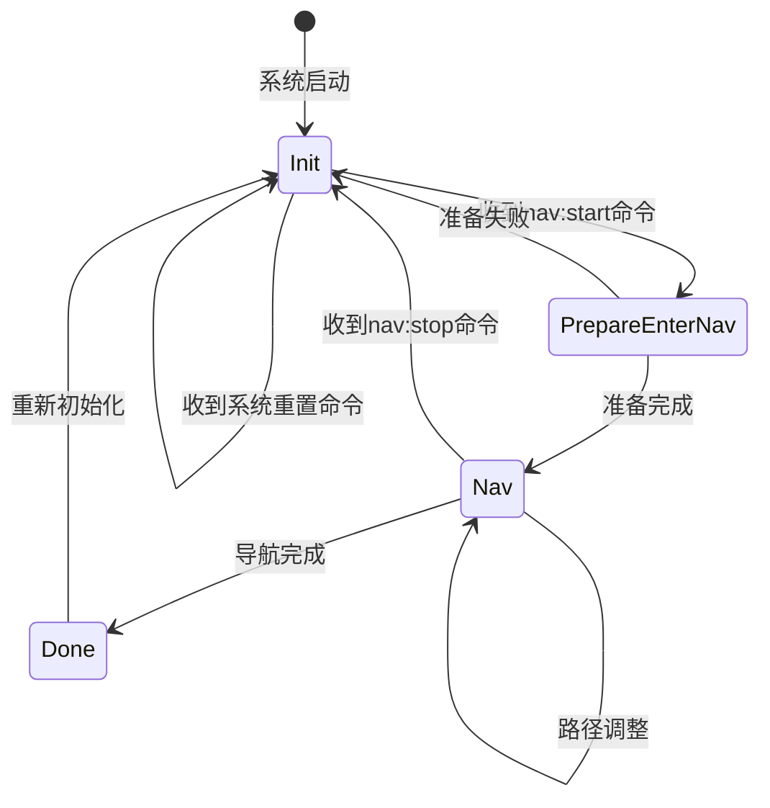
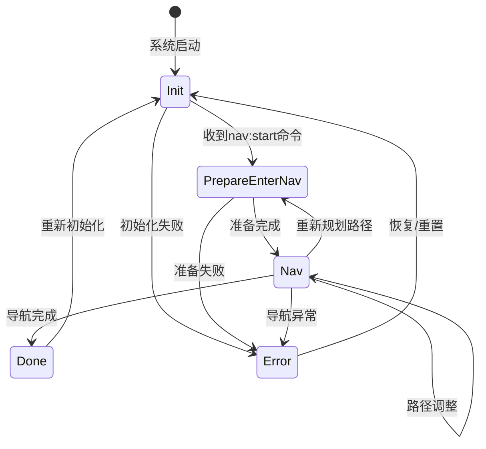
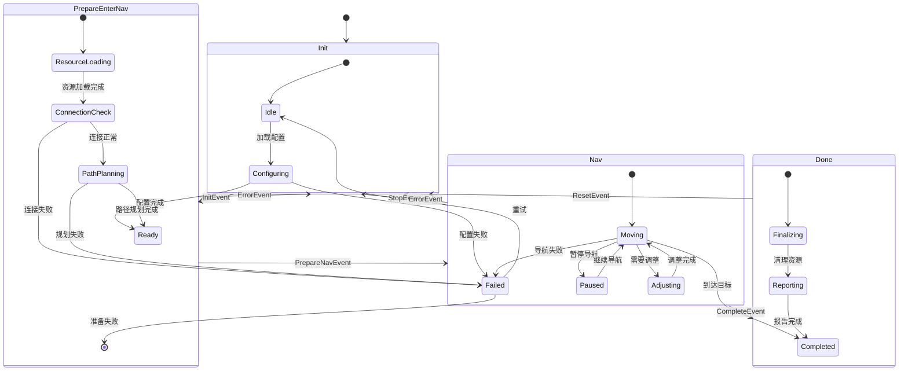
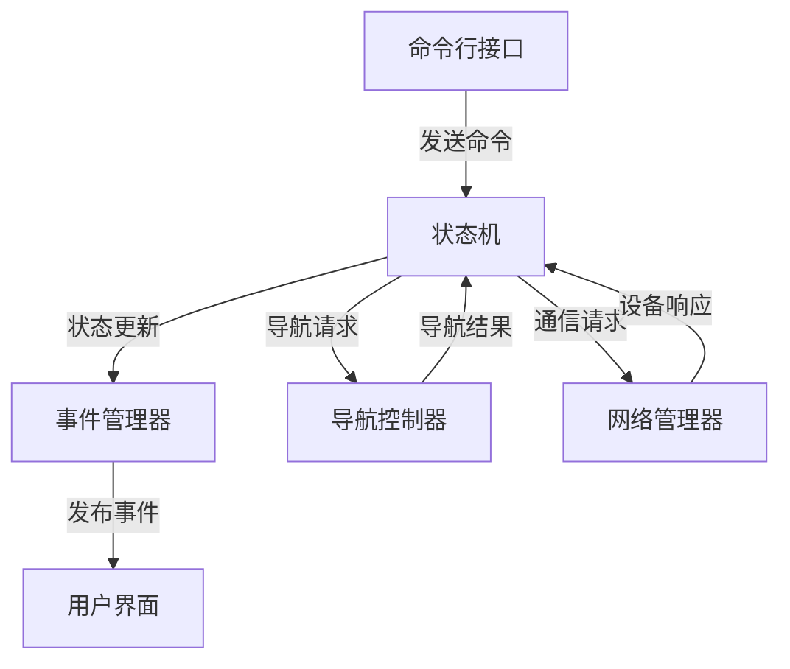

# 状态机图表

## 1. 导航状态机流程图

以下流程图展示了机器狗导航系统的状态转换流程。

### 1.1 基本状态转换图

### 1.2 带错误处理的状态转换图

### 1.3 详细状态与事件关系图

## 2. 状态描述

### 2.1 Init 状态

初始化状态是系统启动后的第一个状态，主要负责系统初始化和资源准备。

**子状态**:
- **Idle**: 空闲状态，等待用户命令
- **Configuring**: 正在加载和应用配置
- **Ready**: 初始化完成，准备进入下一状态
- **Failed**: 初始化失败，需要重试或人工干预

**出口条件**:
- 接收到导航开始命令后转换到PrepareEnterNav状态

### 2.2 PrepareEnterNav 状态

准备进入导航状态，负责导航前的各项准备工作。

**子状态**:
- **ResourceLoading**: 加载导航所需资源，如地图数据
- **ConnectionCheck**: 检查与机器狗的连接状态
- **PathPlanning**: 执行初始路径规划
- **Ready**: 准备完成，可以开始导航
- **Failed**: 准备过程中出错

**出口条件**:
- 所有准备工作完成后自动转换到Nav状态
- 出现错误时回退到Init状态

### 2.3 Nav 状态

导航执行状态，负责控制机器狗按照规划路径进行导航。

**子状态**:
- **Moving**: 正在导航移动中
- **Paused**: 导航暂停
- **Adjusting**: 路径调整中
- **Completed**: 导航完成
- **Failed**: 导航失败

**出口条件**:
- 到达目标位置后转换到Done状态
- 收到停止命令或出错时回退到Init状态

### 2.4 Done 状态

导航完成状态，负责导航后的清理和报告工作。

**子状态**:
- **Finalizing**: 清理导航资源
- **Reporting**: 生成导航报告
- **Completed**: 完成所有后处理

**出口条件**:
- 完成后处理后自动转换回Init状态，准备下一次导航

## 3. 事件定义

| 事件类型 | 描述 | 触发条件 |
|---------|------|---------|
| InitEvent | 初始化事件 | 系统启动或重置时 |
| PrepareNavEvent | 准备导航事件 | 用户发送导航命令 |
| StartNavEvent | 开始导航事件 | 准备工作完成 |
| PauseEvent | 暂停导航事件 | 用户发送暂停命令 |
| ResumeEvent | 恢复导航事件 | 用户发送恢复命令 |
| StopEvent | 停止导航事件 | 用户发送停止命令 |
| AdjustEvent | 调整路径事件 | 检测到障碍物或路径变更 |
| CompleteEvent | 完成事件 | 到达目标位置 |
| ResetEvent | 重置事件 | 导航周期结束 |
| ErrorEvent | 错误事件 | 任何阶段出现错误 |

## 4. 导航状态机的防护措施

为确保状态机的稳定性和可靠性，系统实现了以下防护措施：

1. **超时检测**：每个状态都有超时机制，防止状态卡死
2. **错误恢复**：发生错误时自动回退到安全状态
3. **非法转换防护**：拒绝所有未定义的状态转换
4. **条件验证**：转换前验证所有前置条件
5. **日志记录**：记录所有状态转换和事件处理

## 5. 与其他组件的交互

状态机作为系统的核心组件，与其他组件有密切的交互关系：

状态机通过以下方式与其他组件通信：

1. 从CLI接收用户命令触发状态转换
2. 向事件管理器发送状态变更通知
3. 向导航控制器发送具体导航指令
4. 向网络管理器发送与设备的通信请求
