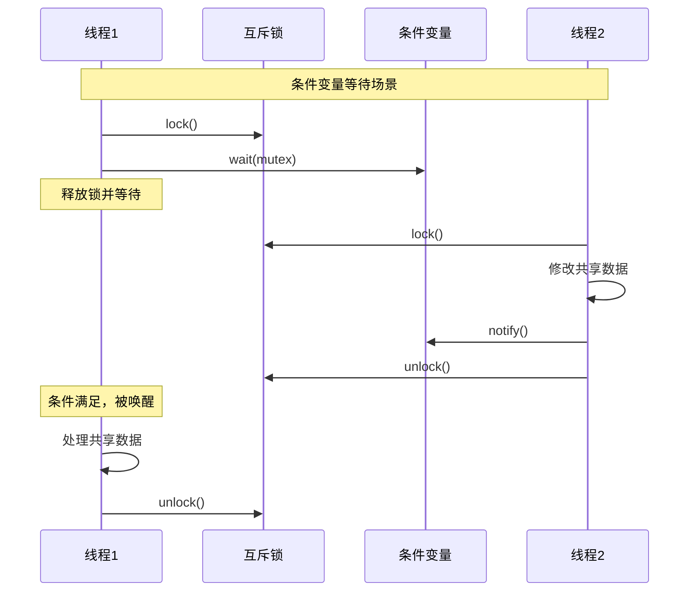

# 线程模型图表

## 1. 线程模型概述

机器狗导航控制系统采用多线程设计，确保系统实时响应和高效性能。本文档详细描述系统的线程架构模型、线程间通信机制以及并发控制策略。

### 1.1 基本线程模型


### 1.2 线程间通信模型


## 2. 线程职责详解

### 2.1 主线程

主线程是系统的入口点，负责与用户的交互和系统生命周期管理。

**职责**:
- 处理用户输入和命令解析
- 显示系统状态和反馈信息
- 管理配置和系统参数
- 协调其他线程的启动和关闭


### 2.2 处理线程

处理线程是系统的核心，负责业务逻辑处理和状态管理。

**职责**:
- 消费消息队列中的消息
- 根据消息类型分发给对应处理器
- 管理导航状态机
- 执行路径规划算法
- 发布状态变更事件


### 2.3 网络线程

网络线程负责与机器狗设备的通信，确保数据传输的可靠性和实时性。

**职责**:
- 管理TCP连接的建立和维护
- 处理数据的发送和接收
- 实现通信协议的编解码
- 处理网络异常和超时


## 3. 线程协作模式

### 3.1 生产者-消费者模式

线程间主要采用生产者-消费者模式进行协作。


### 3.2 观察者模式

使用事件总线实现观察者模式，使组件能够对特定事件做出响应。


### 3.3 任务调度模式

网络操作通过任务调度模式在网络线程中执行。


## 4. 线程同步机制

### 4.1 互斥锁和条件变量

系统使用互斥锁和条件变量实现线程安全的数据访问和线程协作。



### 4.2 原子操作

对于简单的共享变量访问，系统使用原子操作确保线程安全。

```cpp
std::atomic<bool> running{true};
std::atomic<int> messageCount{0};
```

### 4.3 读写锁

对于读多写少的共享数据，使用读写锁提高并发性。


## 5. 线程池设计

对于某些可并行处理的任务，系统使用线程池提高处理效率。

### 5.1 线程池模型


### 5.2 线程池工作流程


## 6. 线程安全设计

### 6.1 线程安全类设计原则


### 6.2 死锁避免策略


## 7. 优化策略

为减少线程间通信开销和提高系统性能，系统采用以下优化策略：

### 7.1 数据局部性优化


### 7.2 无锁算法应用


## 8. 线程使用的最佳实践

### 8.1 线程资源管理


### 8.2 调试和测试策略


## 9. 线程间依赖与启动顺序

系统线程有严格的启动和关闭顺序，确保依赖关系正确。


