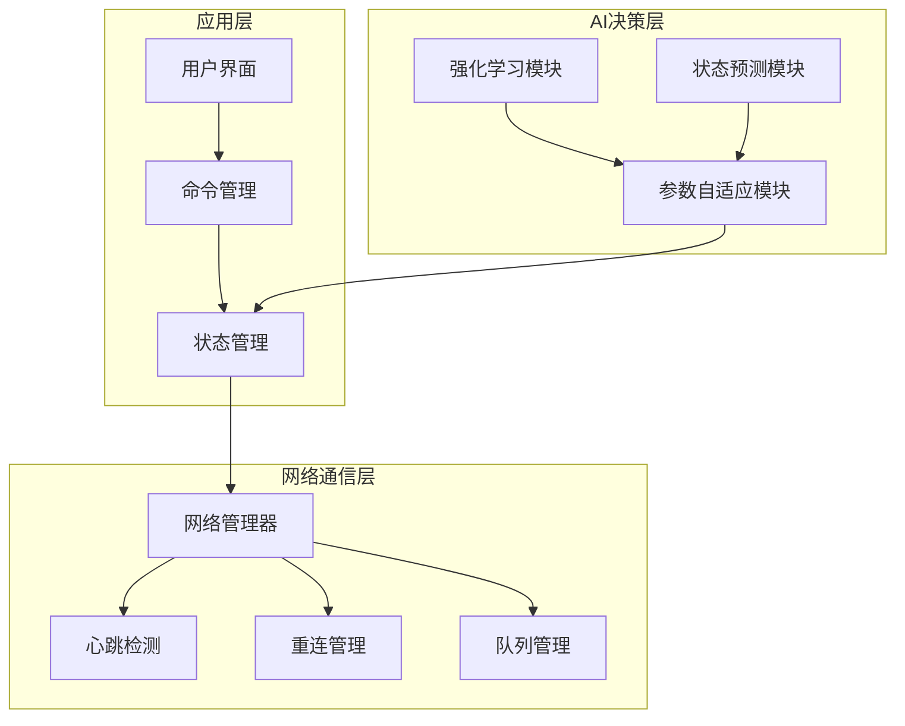
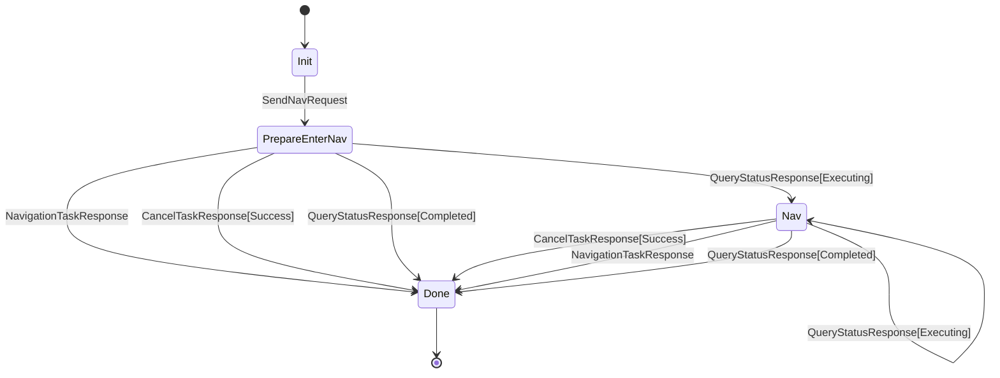
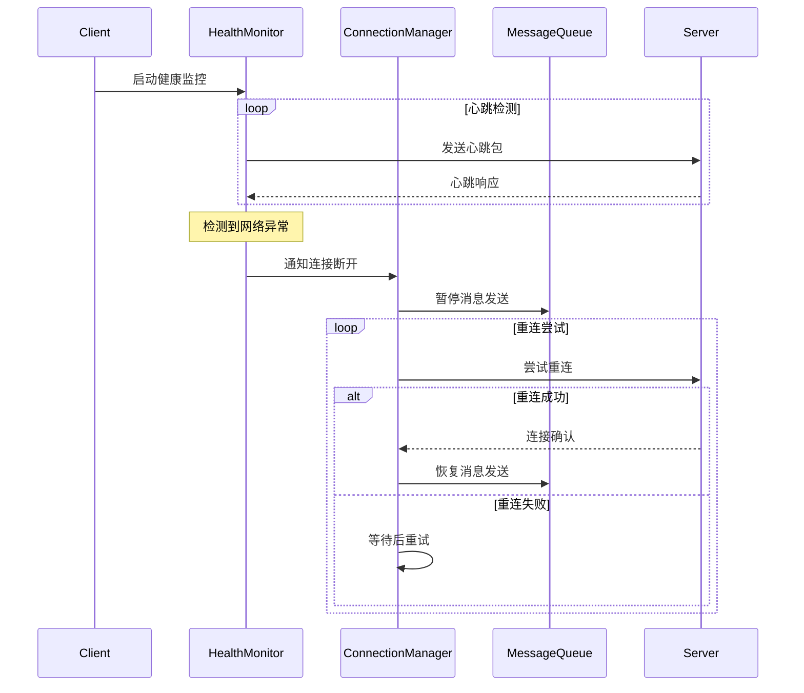
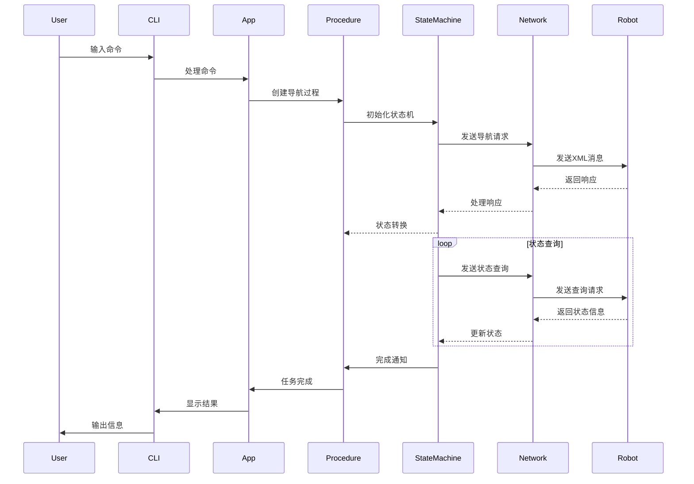
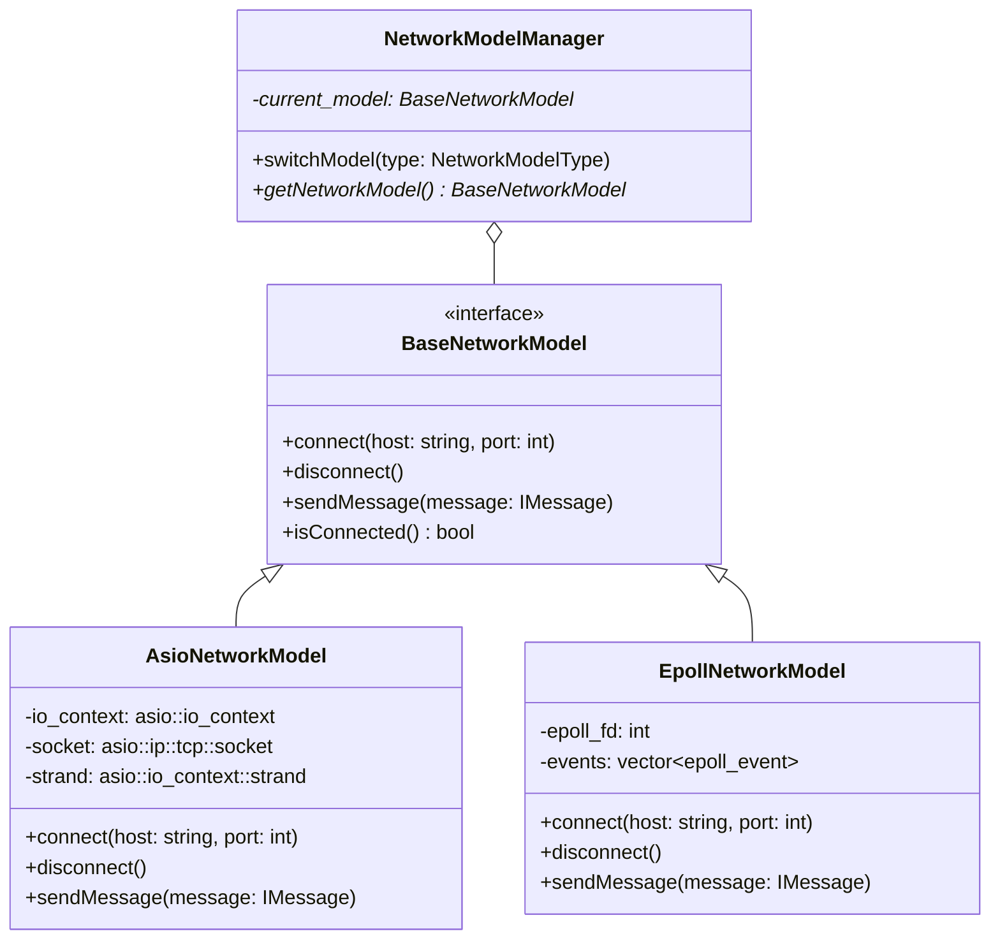
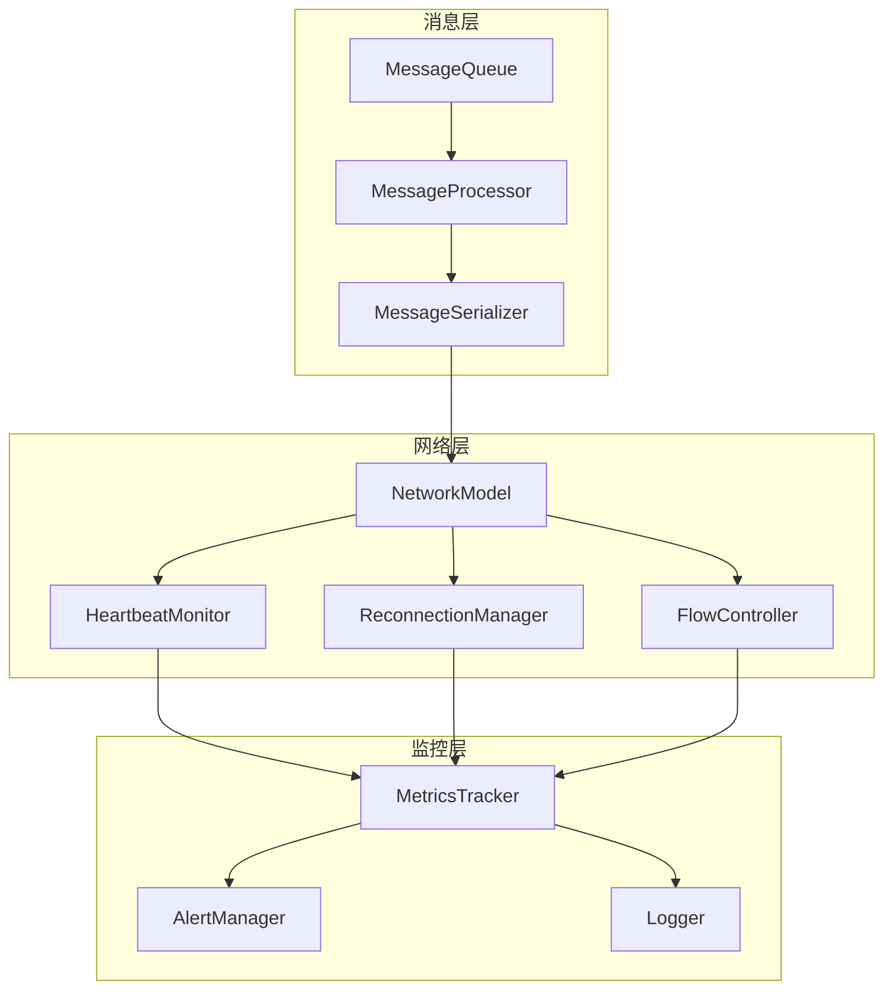

# AI决策模块与网络优化设计方案

## 系统架构图



## 状态机流程



## 1. 路径规划优化

### 1.1 强化学习优化导航路径

```cpp
class PathPlanningRL {
public:
    // 状态空间定义
    struct State {
        Vector3d position;      // 当前位置
        Vector3d orientation;   // 当前朝向
        Vector3d velocity;      // 当前速度
        EnvironmentMap map;     // 环境地图
    };

    // 动作空间定义
    struct Action {
        double linear_velocity;  // 线速度
        double angular_velocity; // 角速度
    };

    // 奖励函数
    double calculateReward(const State& state, const Action& action) {
        double reward = 0;
        reward += distanceToGoalReward(state);    // 距离目标点的奖励
        reward += energyEfficiencyReward(action);  // 能量效率奖励
        reward += smoothnessReward(action);        // 平滑度奖励
        return reward;
    }
};
```

### 1.2 动态避障策略学习

```cpp
class DynamicObstacleAvoidance {
public:
    // 障碍物预测
    struct ObstaclePrediction {
        Vector3d position;      // 位置
        Vector3d velocity;      // 速度
        double uncertainty;     // 不确定性
        double time_horizon;    // 时间范围
    };

    // 避障策略生成
    struct AvoidanceStrategy {
        vector<Vector3d> alternative_paths;  // 备选路径
        vector<double> path_costs;           // 路径代价
        vector<double> collision_risks;      // 碰撞风险
    };
};
```

### 1.3 环境适应性学习

```cpp
class EnvironmentAdaptation {
public:
    // 环境特征提取
    struct EnvironmentFeatures {
        TerrainType terrain_type;          // 地形类型
        SurfaceProperties surface_props;    // 表面属性
        WeatherConditions weather;          // 天气条件
        LightingConditions lighting;        // 光照条件
    };

    // 适应性策略
    struct AdaptationStrategy {
        GaitParameters gait_params;         // 步态参数
        StabilityParameters stability_params; // 稳定性参数
        SpeedParameters speed_params;        // 速度参数
    };
};
```

## 2. 状态预测

### 2.1 状态转换预测

```cpp
class StatePrediction {
public:
    // 状态预测模型
    struct PredictionModel {
        vector<StateTransition> historical_data;  // 历史数据
        vector<double> transition_probabilities;   // 转换概率
        double prediction_confidence;              // 预测置信度
    };

    // 预测结果
    struct PredictionResult {
        State next_state;                         // 预测的下一个状态
        vector<State> possible_states;            // 可能的状态集合
        vector<double> state_probabilities;       // 状态概率
    };
};
```

### 2.2 资源预分配

```cpp
class ResourcePreallocation {
public:
    // 资源需求预测
    struct ResourcePrediction {
        ComputationResources compute;     // 计算资源
        MemoryResources memory;           // 内存资源
        NetworkResources network;         // 网络资源
        BatteryResources battery;         // 电池资源
    };

    // 资源分配策略
    struct AllocationStrategy {
        ResourcePriorities priorities;    // 资源优先级
        ResourceLimits limits;           // 资源限制
        FailoverPlan failover;           // 故障转移计划
    };
};
```

### 2.3 异常预警系统

```cpp
class AnomalyPrediction {
public:
    // 异常模式识别
    struct AnomalyPattern {
        vector<Sensor> sensor_data;       // 传感器数据
        vector<SystemState> system_states; // 系统状态
        vector<double> anomaly_scores;     // 异常分数
    };

    // 预警策略
    struct WarningStrategy {
        vector<WarningLevel> levels;      // 预警级别
        vector<Action> mitigation_actions; // 缓解措施
        NotificationSystem notifications;  // 通知系统
    };
};
```

## 3. 参数自适应

### 3.1 导航参数自动调整

```cpp
class NavigationParameterTuning {
public:
    // 参数优化模型
    struct OptimizationModel {
        vector<Parameter> tunable_params;  // 可调参数
        vector<Constraint> constraints;    // 参数约束
        ObjectiveFunction objective;       // 优化目标
    };

    // 调优策略
    struct TuningStrategy {
        LearningRate learning_rate;        // 学习率
        ConvergenceCriteria convergence;   // 收敛准则
        ValidationMetrics metrics;         // 验证指标
    };
};
```

### 3.2 控制策略优化

```cpp
class ControlStrategyOptimization {
public:
    // 控制模型
    struct ControlModel {
        vector<ControlParameter> params;   // 控制参数
        vector<SystemResponse> responses;  // 系统响应
        PerformanceMetrics metrics;       // 性能指标
    };

    // 优化策略
    struct OptimizationStrategy {
        ModelPredictiveControl mpc;       // 模型预测控制
        AdaptiveControl adaptive;         // 自适应控制
        RobustControl robust;             // 鲁棒控制
    };
};
```

### 3.3 性能自动调优

```cpp
class PerformanceAutoTuning {
public:
    // 性能监控
    struct PerformanceMonitor {
        vector<Metric> system_metrics;    // 系统指标
        vector<Threshold> thresholds;     // 阈值设置
        vector<Trend> performance_trends; // 性能趋势
    };

    // 调优策略
    struct TuningStrategy {
        ResourceAllocation resource_alloc; // 资源分配
        LoadBalancing load_balance;        // 负载均衡
        CacheOptimization cache_opt;       // 缓存优化
    };
};
```

## 4. 网络通信优化

### 4.1 网络故障检测

```cpp
class NetworkHealthMonitor {
public:
    struct HealthMetrics {
        double packet_loss_rate;    // 丢包率
        double latency;             // 延迟
        double bandwidth_usage;     // 带宽使用率
        int error_count;            // 错误计数
    };

    // 心跳检测
    class HeartbeatMonitor {
        std::atomic<bool> is_alive_{true};
        std::chrono::milliseconds timeout_{3000};

        void startMonitoring() {
            while(running_) {
                if(timeSinceLastHeartbeat() > timeout_) {
                    handleConnectionLoss();
                }
                std::this_thread::sleep_for(std::chrono::seconds(1));
            }
        }
    };
};
```

### 4.2 自动重连机制

```cpp
class ConnectionManager {
public:
    // 重连策略
    struct ReconnectionStrategy {
        int max_attempts{5};
        std::chrono::milliseconds base_delay{1000};
        std::chrono::milliseconds max_delay{30000};

        std::chrono::milliseconds getNextDelay(int attempt) {
            return std::min(base_delay * static_cast<int>(std::pow(2, attempt)),
                          max_delay);
        }
    };

    // 会话恢复
    class SessionRecovery {
        std::queue<MessagePtr> unconfirmed_messages_;
        SessionState last_known_state_;

        void restoreSession() {
            reconnect();
            syncState();
            resendUnconfirmedMessages();
        }
    };
};
```

### 4.3 消息队列优化

```cpp
class MessageQueueManager {
public:
    // 优先级队列
    template<typename T>
    class PriorityMessageQueue {
        std::priority_queue<T, std::vector<T>, MessageComparator> queue_;
        std::mutex mutex_;

        void enqueue(T&& msg, Priority priority) {
            std::lock_guard<std::mutex> lock(mutex_);
            queue_.push(MessageWrapper{std::move(msg), priority});
        }
    };

    // 流量控制
    class FlowController {
        size_t window_size_{1024};
        std::atomic<size_t> current_load_{0};

        bool canAcceptMore() {
            return current_load_ < window_size_;
        }

        void updateWindowSize(const NetworkMetrics& metrics) {
            // 根据网络状况动态调整窗口大小
            window_size_ = calculateOptimalWindowSize(metrics);
        }
    };
};
```

## 网络优化时序图



## 消息流程时序图



## 网络模型类图



## 网络优化架构图



## 实现路线图

1. **第一阶段：基础框架搭建**
   - 实现基本的AI决策框架
   - 集成数据收集系统
   - 建立基础评估指标

2. **第二阶段：核心算法实现**
   - 实现强化学习模型
   - 开发状态预测系统
   - 构建参数优化框架

3. **第三阶段：系统集成与优化**
   - 与现有系统集成
   - 性能优化和调试
   - 实际环境测试

4. **第四阶段：持续改进**
   - 收集实际运行数据
   - 优化模型参数
   - 扩展新功能

## 预期效果

1. **性能提升**
   - 导航效率提升20-30%
   - 避障成功率提升至99%
   - 系统响应时间减少50%

2. **可靠性提升**
   - 系统故障预测准确率达到90%
   - 异常处理成功率提升至95%
   - 系统稳定性提升30%

3. **适应性提升**
   - 支持多种环境条件
   - 动态适应环境变化
   - 自主学习优化策略

## 网络优化效果预期

1. **可靠性提升**
   - 网络故障自动恢复率 > 95%
   - 消息传输成功率 > 99.9%
   - 平均故障恢复时间 < 3秒

2. **性能提升**
   - 平均网络延迟降低30%
   - 带宽利用率提升20%
   - 消息处理吞吐量提升50%

3. **运维便利性**
   - 网络状态可视化监控
   - 自动化故障诊断
   - 智能化参数调优
