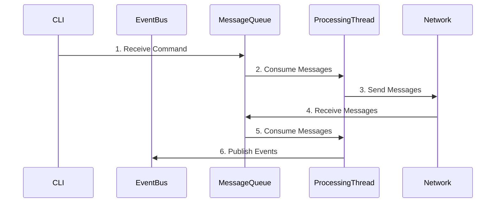

# 机器狗导航控制系统 (Robot Dog Navigation Control System)

## 1. 项目概述

这是一个基于C++实现的机器狗导航业务控制程序，使用boost::msm库实现状态机。该系统主要负责机器狗的自主导航控制，包括路径规划、状态管理和网络通信等功能。

### 1.1 核心功能
- 状态机管理
- 导航控制
- 网络通信
- 命令行交互

### 1.2 技术栈
- 语言：C++ 17
- 状态机：boost::msm
- 网络：boost::asio/epoll
- 构建工具：CMake
- 单元测试：Google Test
- 文档：Doxygen

## 2. 系统架构

### 2.1 分层架构
系统采用三层架构设计：
```
+----------------+
|     App层      | -> CLI界面、命令处理、日志管理
+----------------+
|   Procedure层  | -> 状态机、业务逻辑、消息处理
+----------------+
|   Network层    | -> 网络通信、数据传输
+----------------+
```

### 2.2 线程模型
```
+---------------+     +------------------+     +---------------+
|    主线程     | --> |   ProcessingThread| --> |    网络线程    |
| (CLI处理)     |     | (消息队列处理)    |     | (TCP通信)     |
+---------------+     +------------------+     +---------------+
```

### 2.3 状态机设计
```
+--------+     +----------------+     +-------+     +--------+
|  Init  | --> | PrepareEnterNav| --> |  Nav  | --> |  Done  |
+--------+     +----------------+     +-------+     +--------+
```

### 2.4 消息流程



## 3. 关键组件

### 3.1 消息流转机制
- MessageQueue：消息队列，确保线程安全的消息传递
- EventBus：事件总线，负责组件间的解耦通信
- CLI：命令行接口，处理用户输入
- Network：网络层，处理与机器人的通信

### 3.2 网络模型
提供两种网络实现方案：
1. boost::asio 实现
   - 异步IO
   - 跨平台支持
   - 高性能事件处理

2. epoll 实现
   - Linux原生支持
   - 高并发处理能力
   - 底层控制灵活

## 4. 项目结构

```
project/
├── include/                    # 头文件
│   ├── app/                   # 应用层头文件
│   ├── procedure/            # 业务层头文件
│   └── network/              # 网络层头文件
├── src/                       # 源文件
│   ├── app/
│   ├── procedure/
│   └── network/
├── test/                      # 测试文件
├── docs/                      # 文档
├── third_party/              # 第三方库
└── CMakeLists.txt            # CMake构建文件
```

## 5. 开发指南

### 5.1 环境配置
- CMake >= 3.15
- C++ 17 兼容编译器
- Boost库 >= 1.65
- Google Test框架

### 5.2 构建步骤
```bash
mkdir build
cd build
cmake ..
make
```

### 5.3 运行测试
```bash
cd build
ctest
```

## 6. 接口文档

### 6.1 命令行接口
待补充具体命令列表和参数说明

### 6.2 网络协议
待补充具体协议格式和数据结构

## 7. 开发计划

### 7.1 当前进度
- [x] 基础框架搭建
- [x] 状态机实现
- [x] 网络层框架
- [ ] 完整的单元测试
- [ ] 性能测试和优化

### 7.2 后续计划
- 完善错误处理机制
- 添加配置文件支持
- 实现日志分级
- 性能优化和压力测试

## 8. 维护说明

### 8.1 日志管理
待补充日志格式和级别说明

### 8.2 错误处理
待补充错误码和异常处理机制

### 8.3 性能监控
待补充性能指标和监控方案

## 9. 贡献指南

### 9.1 代码规范
遵循项目代码规范文档

### 9.2 提交规范
- feat: 新功能
- fix: 修复bug
- docs: 文档更新
- style: 代码格式调整
- refactor: 重构
- test: 测试用例
- chore: 其他修改

## 10. 版本历史

### v0.1.0 (MVP)
- 基础框架搭建
- 核心功能实现
- 基本测试用例
